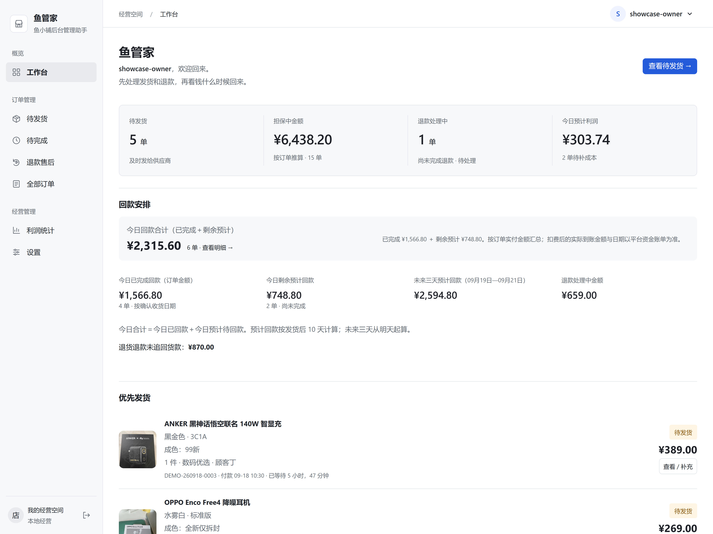
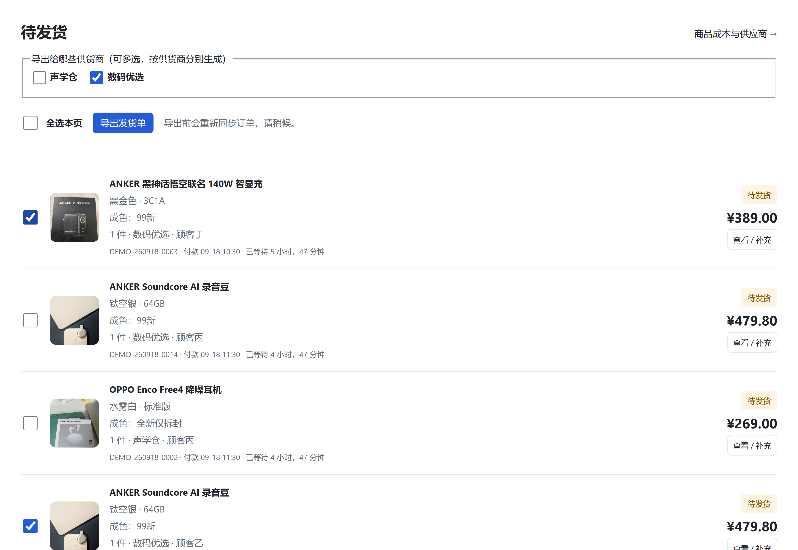
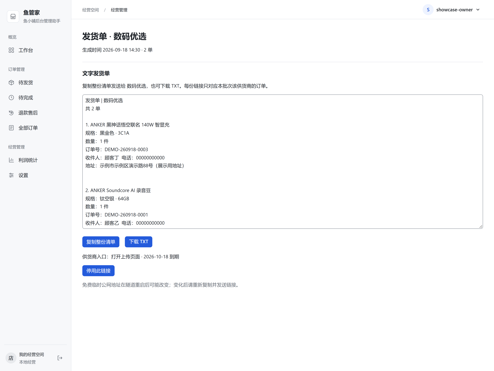
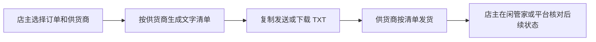
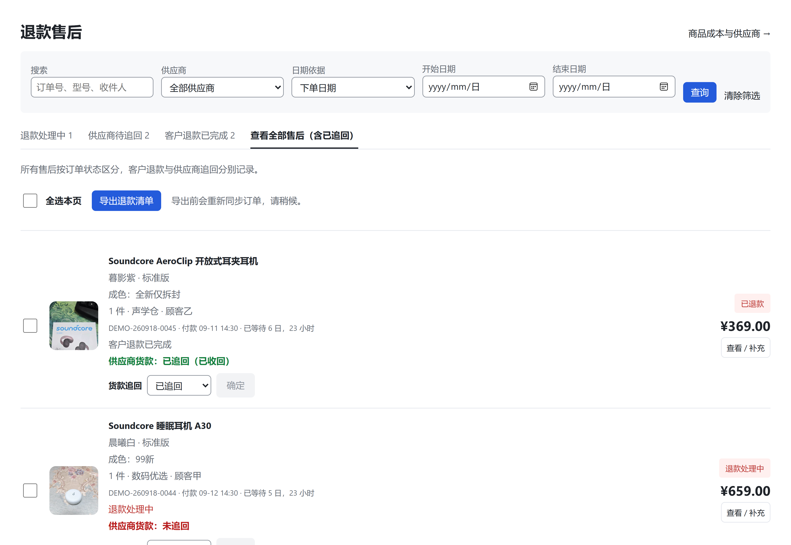
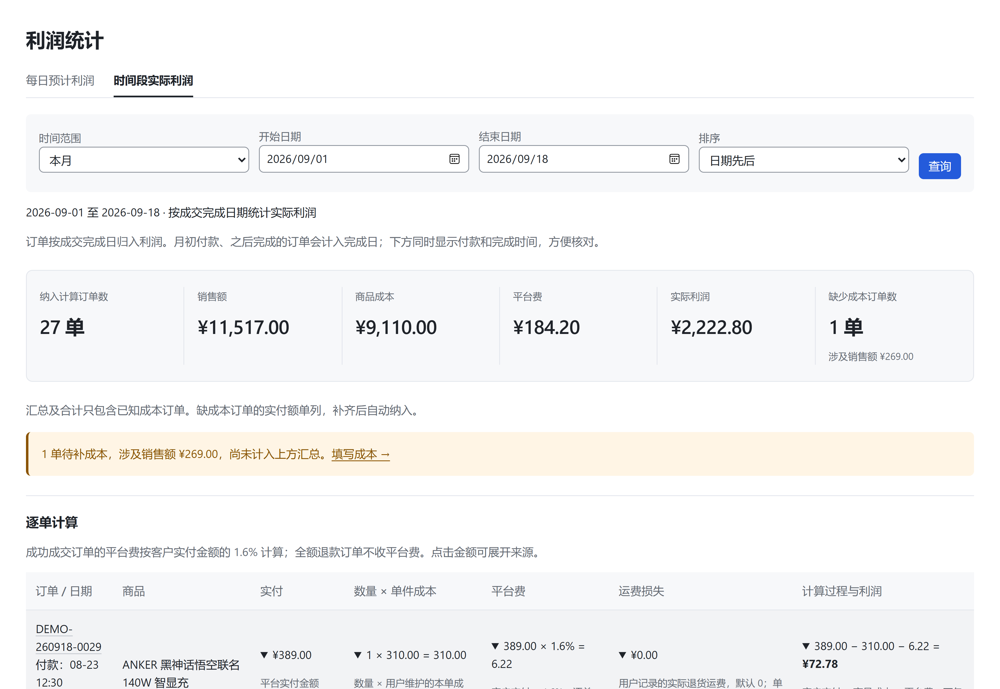

# 鱼管家 · 鱼小铺后台管理助手

**作者：阿栋**（GitHub：[@huoyunpili](https://github.com/huoyunpili)）

原名“小卖铺”，现统一更名为“鱼管家”。GitHub 仓库地址保持不变，已有配置和本地数据目录继续沿用；正式版不再提供供货商远程回传链接。

**今天发哪些货、多少钱还在担保中、什么时候回款、退货的钱追回没有、这一单到底赚了多少。**

鱼管家是面向鱼小铺店主的后台管理助手，把这些日常问题放进一个工作台，面向经营闲鱼 / 鱼小铺的小卖家，尤其适合需要整理供货商发货清单、逐单核对成本和利润的店主。经营数据保存在你自己的电脑上。

当前正式版为 **0.6.0**，采用 [Apache License 2.0](LICENSE) 开源。欢迎小卖家试用、提出问题，也欢迎开发者参与设计、文档、测试和代码贡献。项目独立开发，并非闲鱼、鱼小铺、闲管家或阿奇索官方产品。

[开始试用](#安装与开始使用) · [产品介绍](docs/product/index.html) · [使用手册](docs/manual/index.html) · [公开路线图](ROADMAP.md) · [参与贡献](CONTRIBUTING.md) · [提交问题](https://github.com/huoyunpili/xiaomaipu/issues/new/choose)

## 产品介绍与使用手册

| 文档 | 适合什么时候看 | 内容 |
| --- | --- | --- |
| [鱼管家产品介绍](docs/product/index.html) | 初次了解、向其他卖家介绍 | 产品定位、主要功能、演示截图、订单流程与配置概览 |
| [鱼管家使用与配置手册](docs/manual/index.html) | 准备安装、日常操作、遇到问题 | 安装、API 获取、逐页面操作、文字发货清单、备份迁移与故障排查 |

**如何阅读：** 点击文件链接后，在 GitHub 文件页点击 **Download raw file（下载原始文件）**，保存为 `.html`，再用 Edge / Chrome 打开。也可下载整个仓库 ZIP 后打开对应文件。

两份文件可离线阅读，不需要先启动鱼管家。手册支持目录导航及浏览器打印 / 另存为 PDF；外部下载和反馈链接需要联网。

**适用范围：** 文档整理于 2026-09-18，截图采用演示数据。手册按当前工作区功能编写，部分近期功能尚未同步到公开源码；请先阅读第一章的版本差异。API 资格、套餐和权限以闲管家当前账号页面为准。本次文档更新不会自动升级已安装的软件。

## 五个值得试用的功能

### 1. 打开工作台，先看清生意

待发货、待完成、担保金额、退款中的金额和利润集中展示。需要核对时可以进入订单明细，不必在多份表格里反复找订单。

商品名称、规格、成色、图片和成本信息帮助你认出每一单；平台没有提供的信息不强行编造。同一供货商的历史清单变化合并提醒，减少重复打扰。



*以下截图于 2026-09-18 使用当前版本与独立演示数据拍摄，展示真实界面和操作流程；订单、金额及客户信息均为演示数据。高清图片可点击放大。*

### 2. 回款安排，看清今天与接下来几天

- **今日合计**：今日已完成订单对应回款，加上今日预计待回款，避免重复计算。
- **未来三天预计待回款**：从明天开始，展示接下来三天预计回款的未完成订单。
- **统一参考规则**：默认按发货后 10 天估算，可在设置中调整。

金额可以进入明细核对。这里的“已回款”依据平台订单完成状态统计，预计回款用于安排周转；实际账户入账以平台账单为准。

### 3. 按供货商生成文字发货清单

在待发货页勾选订单和供货商，支持多选，系统按供货商分别生成**可复制的文字清单和 TXT 文件**。商品、规格、数量与收货信息放在一起，方便沟通和填写快递单。



<details>
<summary>查看文字发货清单：复制发送或下载 TXT</summary>



</details>



正式版不生成公网链接，不接收供货商填写的快递单号或视频，也不会因为生成清单而自动向平台提交发货。这样无需中继、域名、Docker 或 Cloudflare，也不会产生项目方必须持续承担的服务器费用。

### 4. 客户退款后，别忘了追回供货商货款

客户退款进度和供货商货款追回分开管理。在退货退款订单上，直接选择“未追回 / 已追回”并确认：未追回显示红色，已追回显示绿色。

待追回金额聚焦**退货退款且尚未追回的货款**；成本未补齐时会提示，避免把未知金额当作 0。这是店主核对后的登记，不会代替你向供货商发起扣款或追偿。



### 5. 利润不只给一个总数，把计算过程也展示出来

支持按付款日期查看预计利润、按成交完成日期查看实际利润，选择今天、本月或自定义时间段，进入逐单明细并导出 CSV。

```text
商品成本 = 数量 × 单件成本
当前平台费参考 = 客户实付 × 1.6%（逐单四舍五入到分）
订单利润 = 客户实付 − 商品成本 − 平台费
```

例如客户实付 200 元，成本 150 元，按当前规则计算平台费 3.20 元，则订单利润为 **46.80 元**。缺少成本的订单单独列出，补齐后再纳入利润合计。退款售后的运费损失单列，便于核对。

**1.6% 是当前版本内置口径，并非所有店铺的通用费率。** 若你的收费规则不同，请先核对并调整代码或反馈需求。利润统计不等同于完整财务报表，未自动计入税费、人工等其他经营开支。



## 安装与开始使用

普通用户只保留一种方式：从 GitHub Releases 下载 **`鱼管家-0.6.0-安装程序.exe`**，双击安装。安装完成后会自动打开鱼管家，首次访问创建自己的店主账号，没有默认账号密码。

安装包已经包含完整经营后台、Python 运行环境和 PostgreSQL 数据库。**不需要预先安装 Docker、Python、uv、Redis、PostgreSQL 或 cloudflared，也不需要下载源码、打开 PowerShell 或选择“基础版 / 完整版”。**

以后可从开始菜单打开“鱼管家”。程序随当前用户登录自动启动，管理后台地址固定为 **http://127.0.0.1:8765**。经营数据、私有配置与备份继续独立保存在 `%LOCALAPPDATA%\XianyuSeller`；升级或卸载程序不会主动删除这些数据。RC 版本已经保存的历史视频也不会因升级被删除。

首次同步订单前，只需在 `%LOCALAPPDATA%\XianyuSeller\config.env` 填入闲管家提供的 `XGJ_APP_KEY` 和 `XGJ_APP_SECRET`，从开始菜单停止并重新打开鱼管家，再到“设置 → 闲管家 API”验证授权店铺。

> GitHub 仓库中的 Docker Compose、uv 和 PowerShell 开发命令仅供开发、测试及发布构建使用，不再作为普通用户安装方式。

## 适合谁，哪些地方还需要一起打磨

适合经营单店、愿意维护商品成本、希望把订单与供货商协作放在一起的小卖家。当前以 Windows 本地部署为主要使用方式，尚不是注册即用的在线平台，也不是多店 SaaS。

历史订单统一先导入闲管家，再在“设置 → 闲管家 API”点击“同步并导入闲管家历史订单”。鱼管家不再接收本地 CSV 或 Excel 订单文件；接口只能读取闲管家允许的近六个月更新时间窗口且单次最多 10000 条，超出范围时需先在闲管家分批整理。闲管家及其他外部服务的授权条件和费用由其提供方决定。

我们特别期待这些反馈：

- 某种订单状态没有识别正确，或展示金额与平台不一致。
- 回款与利润的计算过程不够清楚。
- 文字发货清单是否遗漏了供货商真正需要的信息。
- 有更省步骤的发货、售后追款和对账方式。
- 安装、迁移到家用电脑、备份恢复哪里容易出错。

请通过 [Issues](https://github.com/huoyunpili/xiaomaipu/issues/new/choose) 提交复现步骤、期望结果和已脱敏截图。欢迎提交改进建议或 Pull Request，先阅读 [参与说明](CONTRIBUTING.md)。**不要公开订单号、收货地址、手机号、API 密钥或本机数据文件。**

## 开源许可与官方身份

Copyright © 2026 阿栋（huoyunpili）。

鱼管家采用 [Apache License 2.0](LICENSE) 开源。你可以在许可证允许的范围内使用、修改、分发及商业使用代码；再分发时应保留许可证、版权和 [NOTICE](NOTICE) 中的归属信息。

Apache License 2.0 不授予“鱼管家”名称、Logo 或其他品牌标识的商标权。第三方修改或发行时，应清楚标明其修改和非官方身份，不得暗示获得作者、闲鱼、鱼小铺、闲管家或阿奇索背书。

第三方依赖和素材仍遵循各自许可证，测试视频来源见 [素材说明](tests/fixtures/README.md)。提交贡献即表示你有权提供相关内容，并按照 [DCO](DCO) 和本项目许可证提交。安全问题请阅读 [SECURITY.md](SECURITY.md)，社区参与请遵守 [行为准则](CODE_OF_CONDUCT.md)。

## Codex Skill

仓库包含 [`fish-manager` Skill](skills/fish-manager/SKILL.md)，用于指导 Codex 安装诊断、排查闲管家同步、开发功能和执行安全发布检查。Skill 不会替代鱼管家应用，也不会在未经明确确认时执行真实发货、退款或其他外部业务操作。
