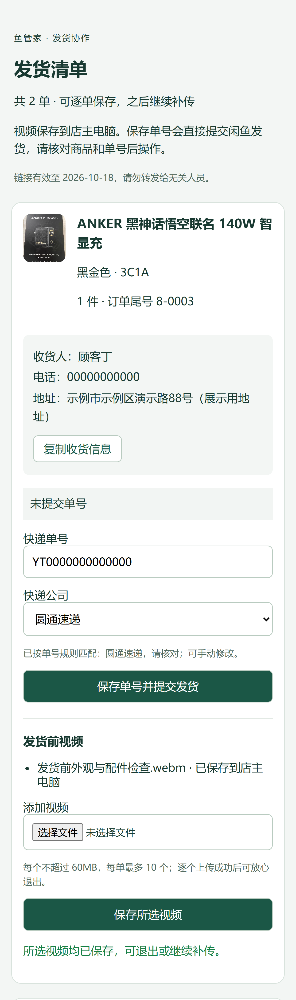
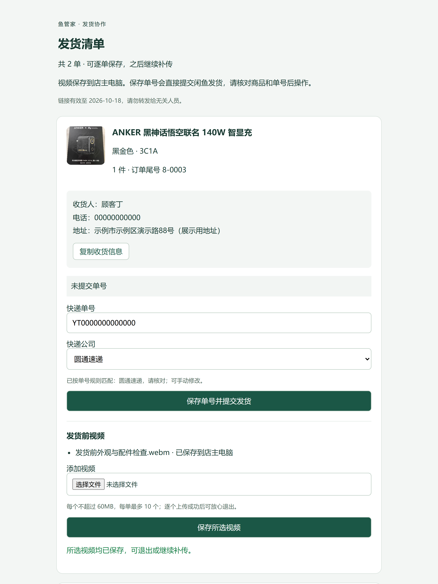
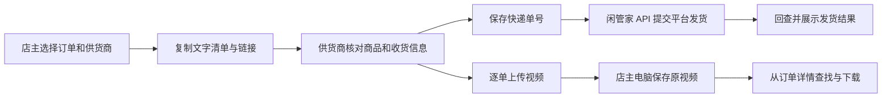

# 鱼管家 · 鱼小铺后台管理助手

**作者：阿栋**（GitHub：[@huoyunpili](https://github.com/huoyunpili)）

原名“小卖铺”，现统一更名为“鱼管家”。GitHub 仓库地址保持不变，已有配置、数据目录和供货商链接继续沿用。

**今天发哪些货、多少钱还在担保中、什么时候回款、退货的钱追回没有、这一单到底赚了多少。**

鱼管家是面向鱼小铺店主的后台管理助手，把这些日常问题放进一个工作台，面向经营闲鱼 / 鱼小铺的小卖家，尤其适合需要与供货商协作发货、逐单核对成本和利润的店主。经营数据和发货视频保存在你自己的电脑上。

当前为 **0.6.0 RC1 社区测试版**。源码公开，欢迎小卖家自用测试、提出问题和分享经营流程；使用范围见文末。项目独立开发，并非闲鱼、鱼小铺或闲管家官方产品。

[开始试用](#开始试用) · [发货与视频流程](docs/supplier-shipping.md) · [使用与反馈](CONTRIBUTING.md) · [提交问题](https://github.com/huoyunpili/xiaomaipu/issues/new/choose)

## 产品介绍与使用手册

| 文档 | 适合什么时候看 | 内容 |
| --- | --- | --- |
| [鱼管家产品介绍.html](docs/鱼管家产品介绍.html) | 初次了解、向其他卖家介绍 | 产品定位、五大亮点、高清演示截图、订单流程与配置概览 |
| [鱼管家使用与配置手册.html](docs/鱼管家使用与配置手册.html) | 准备安装、日常操作、遇到问题 | 18 个章节：API 获取、两种部署方式、逐页面操作、供货商协作、备份迁移与故障排查 |

**如何阅读：** 点击文件链接后，在 GitHub 文件页点击 **Download raw file（下载原始文件）**，保存为 `.html`，再用 Edge / Chrome 打开。GitHub 文件页显示源码属于正常情况，本次上传不等于已开通在线网站。也可下载整个仓库 ZIP 后，打开 `docs` 中的这两个文件。

两份文件均内嵌样式和高清演示截图，可离线阅读和转发，不需要先启动鱼管家。将两个 HTML 放在同一个文件夹，宣传页底部的“详细使用手册”就能直接跳转。手册支持目录导航、命令复制及浏览器打印 / 另存为 PDF；外部下载和反馈链接需要联网。

**适用范围：** 文档整理于 2026-09-18，截图采用演示数据。手册按当前工作区功能编写，部分近期功能尚未同步到公开源码；请先阅读第一章的版本差异。API 资格、套餐和权限以闲管家当前账号页面为准。本次文档更新不会自动升级已安装的软件。

## 五个值得试用的功能

### 1. 打开工作台，先看清生意

待发货、待完成、担保金额、退款中的金额和利润集中展示。需要核对时可以进入订单明细，不必在多份表格里反复找订单。

商品名称、规格、成色、图片和成本信息帮助你认出每一单；平台没有提供的信息不强行编造。同一供货商的历史清单变化合并提醒，减少重复打扰。


*以下截图于 2026-09-18 使用当前版本与独立演示数据拍摄，展示真实界面和操作流程；订单、金额及客户信息均为演示数据。高清图片可点击放大。*

### 2. 回款安排，看清今天与接下来几天

- **今日合计**：今日已完成订单对应回款，加上今日预计待回款，避免重复计算。
- **未来三天预计待回款**：从明天开始，展示接下来三天预计回款的未完成订单。
- **统一参考规则**：默认按发货后 10 天估算，可在设置中调整。

金额可以进入明细核对。这里的“已回款”依据平台订单完成状态统计，预计回款用于安排周转；实际账户入账以平台账单为准。

### 3. 文字发货清单 → 供货商回传 → 平台发货 → 本地视频

在待发货页勾选订单和供货商，支持多选，系统按供货商分别生成**可复制的文字清单和 TXT 文件**。商品、规格、数量与收货信息放在一起，方便沟通和填写快递单。


<details>
<summary>查看文字发货清单：复制发送或下载 TXT</summary>


</details>

供货商打开清单附带的专属链接后，可以：

1. 查看本清单的商品、收货人、电话和地址，一键复制收货信息。
2. 输入快递单号，系统按本地规则识别常见快递，供货商可核对和修改。
3. 点击“保存单号并提交发货”，通过已授权的闲管家 API 向平台提交发货，并回查结果。
4. 逐单上传发货前视频；可以先传一部分，之后继续补传。

视频直接保存到店主电脑，按订单关联。在后台找到订单即可下载原视频，不用在聊天记录或硬盘文件夹里翻找。每个视频最多 60MB，每单最多 10 个；保存时校验完整性，同内容重传自动去重。

**供货商手机端：复制收货信息，填写单号，逐单保存视频。**



<details>
<summary>查看供货商电脑端页面</summary>



</details>



这个功能需要店主具备相应 API 权限、配置好默认发货地址，并运行公网入口。当前临时公网入口使用 Cloudflare Quick Tunnel；无需自有域名，但重建隧道会改变网址，需重新发送链接。供货商链接是访问凭证，请只发给对应供货商。

> 当前已验证上传、隔离权限、重复提交防护及平台回查逻辑；尚未以真实包裹完成生产账号的发货闭环验收。首次使用请用一笔真实、已确认可发货的订单核对账号权限和平台结果。

### 4. 客户退款后，别忘了追回供货商货款

客户退款进度和供货商货款追回分开管理。在退货退款订单上，直接选择“未追回 / 已追回”并确认：未追回显示红色，已追回显示绿色。

待追回金额聚焦**退货退款且尚未追回的货款**；成本未补齐时会提示，避免把未知金额当作 0。这是店主核对后的登记，不会代替你向供货商发起扣款或追偿。


### 5. 利润不只给一个总数，把计算过程也展示出来

支持按付款日期查看预计利润、按成交完成日期查看实际利润，选择今天、本月或自定义时间段，进入逐单明细并导出 CSV。

```text
商品成本 = 数量 × 单件成本
当前平台费参考 = 客户实付 × 1.6%（逐单四舍五入到分）
订单利润 = 客户实付 − 商品成本 − 平台费
```

例如客户实付 200 元，成本 150 元，按当前规则计算平台费 3.20 元，则订单利润为 **46.80 元**。缺少成本的订单单独列出，补齐后再纳入利润合计。退款售后的运费损失单列，便于核对。

**1.6% 是当前版本内置口径，并非所有店铺的通用费率。** 若你的收费规则不同，请先核对并调整代码或反馈需求。利润统计不等同于完整财务报表，未自动计入税费、人工等其他经营开支。


## 开始试用

建议先用测试数据熟悉操作，再接入自己的订单。源码下载不会包含作者的账号、订单、API 密钥或经营视频。

### 方式一：先试用经营后台

适合先看订单、回款、退款和利润功能的 Windows 用户。准备 Docker Desktop，并启动它；下载完整项目后，在项目根目录打开 PowerShell：

```powershell
git clone https://github.com/huoyunpili/xiaomaipu.git
cd xiaomaipu
powershell.exe -NoProfile -ExecutionPolicy Bypass -File scripts/local_release.ps1 -Action Install
```

打开 **http://127.0.0.1:8765**，首次访问创建自己的店主账号，没有默认账号密码。数据默认保存在 `%LOCALAPPDATA%/XianyuSeller`，源码更新与经营数据分开管理。

没有 Git 也可以在仓库页面选择 **Code → Download ZIP**，解压完整源码后运行上述安装脚本。

**这个 Docker 安装入口目前不包含供货商公网上传守护。** 要一起测试供货商回传，请使用下面的 Windows 源码启动方式。详细启停、API 配置、升级和备份恢复见 [本地安装与数据维护](docs/本地发行与数据维护-0.6.0-rc1.md)。

### 方式二：测试完整供货商协作流程

准备 Windows、Python 3.12 或 3.13、uv、Docker Desktop；在独立测试目录中：

```powershell
uv sync --frozen
docker compose -f deployment/compose.yaml up -d --wait
uv run python manage.py migrate
uv run python manage.py bootstrap
powershell.exe -NoProfile -ExecutionPolicy Bypass -File scripts/start_local.ps1
```

浏览器打开 **http://127.0.0.1:8765** 创建店主账号。按 [.env.example](.env.example) 配置自己的闲管家 API，并在设置中验证连接和同步范围；不要提交实际配置文件。

需要让供货商从外网进入时，将来自 [Cloudflare 官方发布](https://github.com/cloudflare/cloudflared/releases) 的 Windows 可执行文件放到 `.local/tools/cloudflared.exe`，然后执行：

```powershell
powershell.exe -NoProfile -ExecutionPolicy Bypass -File scripts/start_supplier.ps1
```

后台守护会检查专用上传服务，进程退出后尝试恢复；当前公网地址保存在 `.local/supplier-runtime.json`，同时写入后台配置。回到待发货页生成清单，复制其中的链接即可。电脑须保持开机、联网、不休眠；不要将管理后台的 8765 端口直接暴露到公网。

这套方式用于当前社区测试；家用电脑长期部署还需要配置系统启动、备份和恢复验证，见 [上传服务运行说明](docs/supplier-service-operations.md)。不要同时启动两套使用相同端口的环境。

## 适合谁，哪些地方还需要一起打磨

适合经营单店、愿意维护商品成本、希望把订单与供货商协作放在一起的小卖家。当前以 Windows 本地部署为主要使用方式，尚不是注册即用的在线平台，也不是多店 SaaS。

历史订单只能在接口能够提供或你已经取得可导入数据的前提下补入，系统不能自动获得未授权的历史订单。视频本地保存可以帮助整理证据，但不能保证纠纷处理结果。闲管家及其他外部服务的授权条件和费用由其提供方决定。

我们特别期待这些反馈：

- 某种订单状态没有识别正确，或展示金额与平台不一致。
- 回款与利润的计算过程不够清楚。
- 供货商用手机操作时遇到困难，或快递识别不准确。
- 有更省步骤的发货、售后追款和对账方式。
- 安装、迁移到家用电脑、备份恢复哪里容易出错。

请通过 [Issues](https://github.com/huoyunpili/xiaomaipu/issues/new/choose) 提交复现步骤、期望结果和已脱敏截图。欢迎提交改进建议或 Pull Request，先阅读 [参与说明](CONTRIBUTING.md)。**不要公开订单号、收货地址、手机号、API 密钥、真实供货商访问链接或原始视频。**

## 开发与验证

技术栈：Django、PostgreSQL、Celery、Redis，服务端页面与原生 JavaScript；本地发行环境使用 Docker Compose，公网上传入口与管理后台分离。

```powershell
uv run playwright install chromium
uv run python scripts/check.py
```

检查包含格式、静态类型、Django 配置、迁移一致性及自动化测试；浏览器回归覆盖桌面和手机页面。正式安装镜像及数据恢复有独立验证脚本。测试通过说明已覆盖场景符合预期，并不代表所有卖家账号和长期运行环境都已验收。

- [产品需求](PRD-闲鱼小卖家后台管理系统-MVP.md)
- [技术实现](技术实现文档-闲鱼小卖家后台管理系统-MVP.md)
- [发货、视频和接口边界](docs/supplier-shipping.md)
- [快递识别规则](docs/courier-rules.md)
- [回归与发布要求](docs/2026-09-16-regression-release.md)

## 使用范围与版权

Copyright © 2026 阿栋（huoyunpili）。保留其他未明确授予的权利。

本项目不采用 MIT、GPL 等标准开源许可证。作者允许小卖家下载、本地运行，并为**自己的小店后台**进行必要修改；欢迎按本仓库说明提交问题与改进。

未经作者另行许可，不得将本项目或其修改版出售、打包为商业产品、作为收费软件的一部分交付，或面向第三方提供收费托管服务。自己小店的日常经营使用属于上述允许范围，不因店铺有交易收入而被禁止。公开源码不表示授权上述商业再分发。

第三方依赖和素材仍遵循各自许可证；测试视频来源见 [素材说明](tests/fixtures/README.md)。
