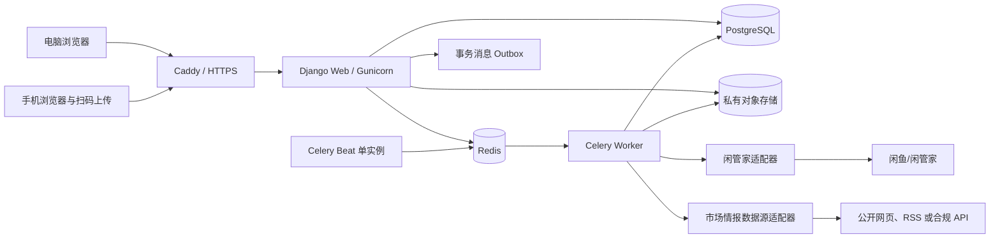
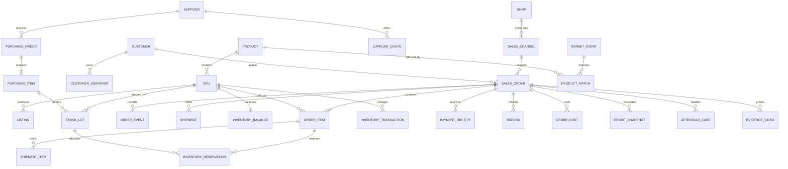
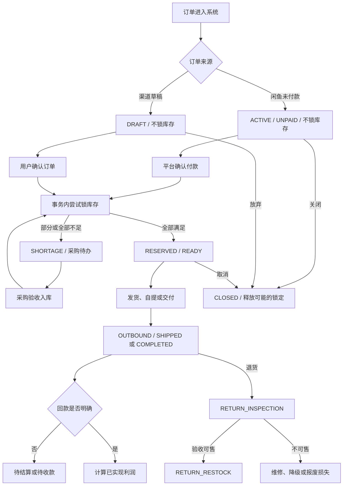

# 闲鱼小卖家后台管理系统 MVP 技术实现文档

> 版本：V0.6（对齐 PRD V0.6）  
> 日期：2026-09-14  
> 状态：钱货闭环与本地发行技术设计已补齐；新增设计尚待实现与验证，不代表代码完成  
> 关联文档：《PRD-闲鱼小卖家后台管理系统-MVP.md》《M1-核心业务规则包.md》《项目完成计划-闲鱼小卖家后台管理系统-MVP.md》《开发流程与质量保障计划.md》

## 1. 文档目标

本次以 [PRD 第 25～27 章](PRD-闲鱼小卖家后台管理系统-MVP.md)及 2026-09-14 工作区代码为依据，新增第 27～35 章，作为下一轮开发的执行基线。第 1～26 章保留前期设计及历史记录，其中拟定表名不等于现有 ORM 模型；涉及新增钱货规则、API 分工、本地部署、存储及开发优先级时，以第 27～35 章为准。历史测试数量未在本轮重跑，不用于证明新增需求完成。

本地单店版本通过 GitHub 分发，每个使用者独立安装并持有自己的数据与凭据；不建设中心平台、租户计费或统一代管账号。公网回调、云服务器和对象存储均不是本轮发行前置条件。此定位替代旧文档的云端优先方案。

2026-09-08 本地交付更新：0.3.0 已实现直发、剩余未发关闭、客户、私有视频、异步 CSV/XLSX 导入、报表与市场风险模块；66 项测试通过，镜像与生产配置门禁通过，本地备份已在独立数据库恢复核对。查验入口与当前边界详见《docs/本地统一查验说明-0.3.0.md》，具体完成记录见《docs/本地开发完成清单.md》。

2026-09-08 分批履约更新：新增 `Shipment` 与 `Reservation.shipment`，发货服务在订单事务内按实际数量拆分分配并扣减库存，每批保留独立成本、费用、物流和交付状态。订单新增 `PARTIAL`，允许继续采购与备货，完整说明见《docs/M4-销售分批履约执行记录.md》。

2026-09-08 缺货关联更新：采购单新增可空的 `order_item`，从缺货销售明细创建。到货备货服务锁订单及库存余额，校验双版本和实际货况确认后创建销售库存分配，保留原开单说明与实际实物快照。详见《docs/M4-缺货采购关联执行记录.md》。

2026-09-08 采购实现：新增 `procurement` 应用，供应商报价采用新增记录保留历史；采购单保留名称、货况与成本快照。分次收货关联实物组和库存流水，采购付款及退款写采购事件，退回供应商时按可用库存扣减并调整应付。缺货订单关联、直发和销售分批履约仍待实现。详见《docs/M4-采购与供应商执行记录.md》。

2026-09-08 成本录入调整：新增商品和入库只填写“单件进货成本”，按卖家实际记账金额记录，不单独输入采购运费。新录入的单位采购运费分摊为 0；下文成本模型中的运费字段保留用于历史兼容，货盘统一显示合计进货成本，不改写历史订单快照。

本文档定义 MVP 的技术架构、工程结构、数据模型、事务边界、接口、文件存储、安全、测试、部署及开发顺序。目标是在保持开发速度的同时，优先保证订单、库存、资金、利润和取证文件正确、可追溯、可恢复。

本文档是开发基线。闲管家公开文档能够证明存在订单列表、订单详情、发货等接口，但个人卖家的实际准入、套餐、服务项、配额、售后、资金和推送权限仍需真实账号验证。因此在 M2 与 M3 之间增加 M2A 前置验证，不等到完整功能开发结束后才确认接口可用性。外部字段始终通过适配层和契约附件进入系统，不反向污染核心业务模型。

## 2. 技术目标与约束

### 2.1 业务规模

- 单个鱼小铺，多销售渠道。
- 初期管理员一人，可增加操作员。
- 日均约 20～50 单。
- 至少支持 10 万笔历史订单、百万级事件和流水。
- 主要是自有库存，兼容缺货采购和供应商直发。
- 手机承担扫码上传视频和部分高频操作，电脑承担集中管理和报表。

### 2.2 技术质量目标

- 正常网络下常用列表和工作台 95% 请求在 2 秒内返回。
- 订单、库存、资金关键写操作必须具备事务和幂等保护。
- 外部 API、定时任务和文件存储故障不得破坏核心业务数据。
- 生产数据每日备份，数据库与对象文件均可恢复。
- 关键操作有审计记录，敏感信息默认脱敏。
- 发布可以回滚应用；数据库迁移采用向前兼容策略。

### 2.3 轻量化实现边界

- 所有页面按单店、日均 20～50 单设计，不提供多店铺切换、多仓调拨、库位、波次、PDA 或复杂审批。
- 第一版不建立发票、税率、税号、会计科目和凭证等数据模型、页面或接口。
- 库存日常操作只提供当前数量、锁定数量、安全库存、成本和调整原因等必要信息；常用调整应在列表或简短弹窗内完成。
- 库存批次和流水用于保证成本与追溯正确，默认由采购入库、订单和退货动作自动生成，不要求用户日常理解或手工维护底层批次。
- CSV/XLSX 是首次初始化、历史补录和 API 故障兜底，不是每日库存维护的必经流程。
- 新功能必须说明它减少了什么人工步骤；仅服务大型卖家、多店或复杂仓储的能力不进入 MVP。

## 3. 总体技术选型

### 3.1 推荐技术栈

| 层次 | 选型 | 版本策略 | 选择理由 |
|---|---|---|---|
| 语言 | Python | 3.13 最新补丁版 | 生态成熟，适合业务后台、数据导入和市场情报处理 |
| Web 框架 | Django | 5.2 LTS 最新补丁版 | 内置认证、权限、ORM、迁移、表单和管理后台，减少自建基础设施 |
| 页面交互 | Django Templates + htmx | htmx 2.x 锁定补丁版 | 服务端渲染为主，局部交互无需维护独立 SPA |
| UI | Bootstrap | 5.3 最新补丁版 + 项目主题 | 响应式能力成熟，适合电脑和手机后台页面 |
| 图表 | Chart.js | 锁定稳定版本 | 满足销量、利润、库存和风险趋势图 |
| 数据库 | PostgreSQL | 17 最新补丁版 | 事务、行锁、约束、JSON 和查询能力适合经营底账 |
| 异步任务 | Celery | 5.6 最新补丁版 | 处理导入、同步、视频检查和每日市场情报任务 |
| 消息代理/缓存 | Redis | 8.0 系列锁定补丁版 | Celery broker、短期缓存、分布式锁和限流 |
| 私有文件 | 本地持久化目录；S3 为后续可选适配 | 与发行程序分离 | 视频与备份不依赖付费云存储 |
| Web 服务 | Gunicorn + Caddy | 锁定稳定版本 | 多进程运行、反向代理、HTTPS 和静态文件服务 |
| 容器 | Docker Compose | 发行时验证并记录版本 | Windows 本地运行 Linux 应用容器，统一管理依赖与服务 |
| 测试 | pytest + pytest-django + Playwright | 锁定稳定版本 | 单元、数据库集成和浏览器端到端测试统一使用 Python 工具链 |
| 质量 | Ruff + mypy + pre-commit | 锁定稳定版本 | 格式、静态检查和提交前检查自动化 |

所有依赖必须写入锁文件，不使用不受控的浮动版本。安全更新以补丁版本升级为主；框架大版本升级单独评审。

M3 实现记录（2026-09-07）：生产镜像/CI 使用 Python 3.13，本机开发兼容已安装的 Python 3.12；依赖统一由 `uv.lock` 固定。当前实际锁定 Django 5.2.17、Celery 5.6.3。M3 简单页面使用本地样式，Bootstrap/htmx/Chart.js 在对应页面需要时接入。评审、实现差异及验证结果见《docs/M2-技术评审与M3执行记录.md》。

### 3.2 选择模块化单体而非微服务

MVP 使用一个 Django 项目、一个 PostgreSQL 数据库和一个异步任务集群。业务按模块隔离，但部署为模块化单体。

原因：

- 当前单店铺、低并发，不需要微服务扩缩容复杂度。
- 订单、库存和资金需要强事务，一库事务最稳妥。
- 一套代码更容易测试、部署、备份和回滚。
- 未来确有压力时，可先独立异步任务和市场情报，再考虑拆服务。

### 3.3 不采用独立 SPA 的原因

- 这是内部经营系统，搜索、表单、列表和工作台占主要场景。
- Django 服务端渲染配合 htmx 可以满足局部刷新、筛选、弹窗和异步任务进度。
- 避免同时维护前端 API 状态、认证令牌和两套构建发布流程。
- Bootstrap 提供响应式布局；手机端重点页面单独设计，而不是缩小桌面表格。

如果真实使用证明需要复杂离线能力或原生体验，再在稳定内部 API 之上增加独立移动端，不在 MVP 预先承担成本。

## 4. 系统架构



### 4.1 请求分工

- Django Web 处理页面、表单、查询、短事务和上传授权。
- Celery Worker 处理长耗时、可重试任务，不在 HTTP 请求内执行大文件解析或外部同步。
- Celery Beat 只运行一个调度实例，负责触发补偿同步、超时扫描、每日市场情报和备份检查。
- PostgreSQL 是业务事实来源；Redis 不是订单、库存或资金的最终存储。
- 对象存储保存文件；数据库保存文件身份、归属、哈希、大小和状态。

### 4.2 一致性边界

- 同一数据库内的订单、库存、资金和审计变更使用短事务完成。
- 数据库与对象存储、外部 API 之间不假设分布式事务。
- 跨系统动作使用“数据库状态 + Outbox + 幂等任务 + 对账补偿”实现最终一致。
- 异步任务必须允许重复执行，不能依赖“消息绝不会重复”。

## 5. 工程目录设计

```text
project/
├─ app/
│  ├─ config/                 # settings、urls、celery、ASGI/WSGI
│  ├─ common/                 # 金额、时间、ID、异常、审计、幂等、基类
│  ├─ accounts/               # 用户、角色、登录和权限
│  ├─ shops/                  # 单鱼小铺配置、销售渠道
│  ├─ catalog/                # 商品、SKU、闲鱼刊登、生命周期
│  ├─ customers/              # 客户、标识、标签、风险和合并
│  ├─ suppliers/              # 供应商和报价
│  ├─ procurement/            # 采购单、到货和采购退款
│  ├─ inventory/              # 库存余额、批次、锁定、流水和盘点
│  ├─ orders/                 # 销售订单、明细、状态和履约
│  ├─ finance/                # 收款、退款、费用、利润和资金占用
│  ├─ aftersales/             # 退款、退货、换货、补发和纠纷
│  ├─ evidence/               # 上传令牌、原视频、预览和访问授权
│  ├─ imports/                # CSV/XLSX 导入、映射、预览和错误报告
│  ├─ integrations/           # 闲管家及其他外部适配器
│  ├─ intelligence/           # 市场来源、文章、事件、匹配和风险
│  ├─ dashboard/              # 工作台、待办和经营汇总
│  ├─ notifications/          # 站内通知；外部通知接口预留
│  ├─ audit/                  # 审计日志和安全事件
│  ├─ templates/              # 页面与局部模板
│  └─ static/                 # 本地化前端依赖、CSS、JS、图标
├─ tests/
│  ├─ unit/
│  ├─ integration/
│  ├─ contract/
│  ├─ e2e/
│  └─ fixtures/               # 脱敏样例，不含真实客户数据
├─ deployment/
│  ├─ compose.yaml
│  ├─ compose.production.yaml
│  ├─ Caddyfile
│  └─ backup/
├─ docs/
├─ scripts/
├─ manage.py
├─ pyproject.toml
├─ uv.lock
├─ .env.example
└─ README.md
```

每个业务模块内部建议使用 `models.py / services.py / selectors.py / forms.py / views.py / tasks.py / policies.py / tests/`。关键写操作进入 `services.py`，复杂查询进入 `selectors.py`；不得依赖 Django signal 隐式执行库存或资金副作用。

## 6. 数据建模通则

### 6.1 标识、时间和金额

- 业务主键使用 UUID，避免外部暴露连续数据库 ID。
- 对用户展示的订单号、采购单号等使用独立可读编号，并建立唯一约束。
- 所有表包含 `created_at`、`updated_at`；事件和流水另有不可变的 `occurred_at`。
- 数据库时间使用带时区时间戳，应用统一按 `Asia/Shanghai` 展示。
- 金额存储为人民币分的 `bigint`；数量使用整数，确需非整数时单独引入精确小数和单位。
- 外部原始金额和解析结果分别保存，解析失败不得默认为零。

### 6.2 删除策略

- 订单、收款、退款、库存流水、采购流水、成本快照、售后和审计日志不物理删除。
- 商品、客户、供应商和渠道使用停用或归档状态。
- 错误导入预览可按保留策略清理，但正式写入的业务记录必须用冲正或更正事件处理。
- 视频原文件删除需满足保留策略、权限和审计要求；数据库保留删除时间、原因和文件摘要。

### 6.3 乐观与悲观并发

- 普通资料编辑使用 `updated_at` 或版本号进行乐观并发检查。
- 库存锁定、释放、出库和关键收款确认使用 PostgreSQL 行锁。
- Django 实现使用 `transaction.atomic()` 包围单个业务动作，并使用 `select_for_update()` 锁定订单、库存余额、锁定记录或收款汇总行。
- 数据库采用 PostgreSQL 默认 `READ COMMITTED` 隔离级别，关键正确性由行锁、唯一约束、检查约束和幂等键共同保证；不依赖提高全库隔离级别解决业务并发。
- 不对所有请求开启全局事务；关键服务函数使用显式短事务。
- 外部请求、文件上传和耗时解析不得在持有数据库行锁时执行。

## 7. 核心数据模型

以下为逻辑表名；实际 Django 模型名可采用单数类名和模块前缀。

### 7.1 账号、店铺和渠道

#### `accounts_user`

- `id`、`username`、`password_hash`、`display_name`
- `role`：ADMIN / OPERATOR
- `is_active`、`last_login_at`
- 继承 Django 用户与权限机制，不自建密码算法。

#### `shops_shop`

- `id`、`name`、`platform=XIANYU`
- `external_shop_id`、`status`
- 第一版数据库只允许一个启用的鱼小铺；约束通过服务层和数据库条件唯一索引保证。

#### `shops_sales_channel`

- `id`、`code`、`name`、`channel_type`
- `is_platform`、`is_active`
- 默认收款方式、默认费用规则、默认取证提醒。
- 预置 XIANYU、WECHAT、REFERRAL、OFFLINE、OTHER_PLATFORM、OTHER。

### 7.2 客户

#### `customers_customer`

- `id`、`display_name`、`status`、`risk_level`
- `first_order_at`、`last_order_at`
- `notes`、`merged_into_id`。

#### `customers_customer_identifier`

- `customer_id`、`channel_id`
- `identifier_type`、`identifier_value_encrypted`、`identifier_hash`
- `display_value_masked`、`is_verified`
- 对稳定标识的哈希建立唯一约束；明文敏感值加密保存。

#### 其他客户表

- `customers_tag`、`customers_customer_tag`
- `customers_risk_record`：依据类型、关联订单/售后、说明和证据。
- `customers_action_suggestion`：建议拉黑、延后时间、处理结果和操作人。
- `customers_merge_record`：合并双方、原因和原标识快照。

### 7.3 商品与刊登

#### `catalog_product`

- SPU 级名称、品牌、品类、生命周期状态和监控关键词。
- 快速建档只必填名称，内部 SKU 自动创建并生成编码；品牌、品类、规格等描述属性可空，不要求正品认证或标准质检等级，不默认全新、正品或无瑕疵。

#### `catalog_sku`

- `product_id`、内部 SKU 编码、规格、成色、序列化管理方式。
- 安全库存、补货周期、风险阈值、是否启用。
- 默认货况字段：`condition_description`（多行自由文本）、`condition_label`（可空自定义成色文本）、`condition_tags`（可空自定义标签列表）、`accessories_description`、`defect_description`、`function_description`、`internal_notes`。均选填，不以固定枚举限制货况；空值表示未记录。
- 货况照片使用独立附件关联，复用私有对象存储和访问授权。表单以自由说明为主，快捷标签为辅；标签操作不重写说明文字，内部备注不进入对外刊登内容。
- 内部建档与渠道发布分开校验；渠道必填属性只约束对应发布动作，不阻断内部保存。

#### `catalog_listing`

- 关联 SKU、销售渠道和外部商品 ID。
- 标题、展示价格、上架状态、最近同步时间。
- 同一店铺下闲鱼外部商品 ID 唯一。

### 7.4 销售订单

#### `orders_sales_order`

- `id`、`order_no`、`shop_id`、`channel_id`、`customer_id`
- `external_order_no`、`source_type`：API / IMPORT / MANUAL
- `lifecycle_status`、`fulfillment_status`、`payment_status`、`inventory_status`、`aftersale_status`、`evidence_status`
- `external_status_code`、`external_status_text`、`external_updated_at`，用于保留平台原状态和排查映射。
- `ordered_at`、`paid_at`、`confirmed_at`、`shipped_at`、`completed_at`、`closed_at`
- `currency=CNY`、`gross_amount_cents`、`discount_cents`、`receivable_cents`
- 收件信息使用加密字段和脱敏展示字段。
- `version` 用于乐观并发；关键状态转换仍由服务层和事务控制。

唯一约束：

- `order_no` 全局唯一。
- 闲鱼订单的 `(shop_id, external_order_no)` 在外部单号非空时唯一。
- 其他平台的 `(channel_id, external_order_no)` 在外部单号非空时唯一。

状态字段使用稳定英文代码，中文仅作为界面文案：

| 维度 | 主要代码 |
|---|---|
| 生命周期 | DRAFT、ACTIVE、COMPLETED、CLOSED、MANUAL_REVIEW |
| 履约 | NOT_REQUIRED、PENDING_STOCK、SHORTAGE、READY、SHIPPED、DELIVERED、PICKUP_READY、COMPLETED、CANCELED |
| 收款 | UNPAID、PLATFORM_HELD、PARTIALLY_PAID、PAID、SETTLING、SETTLED、PARTIAL_REFUND、REFUNDED、RISK、BAD_DEBT、MANUAL_REVIEW |
| 库存 | NOT_ALLOCATED、PARTIALLY_RESERVED、RESERVED、SHORTAGE、OUTBOUND、RETURN_INSPECTION、RESTOCKED |
| 售后摘要 | NONE、OPEN、RETURNING、INSPECTION、DISPUTE、RESOLVED、CLOSED |
| 取证 | NOT_REQUIRED、MISSING、UPLOADING、AVAILABLE、UPLOAD_FAILED、FILE_ERROR |

“拍下未付款”“已付款待备货”等用户可见阶段由多个维度组合生成，不再作为唯一数据库状态。例如闲鱼的“拍下未付款”对应 ACTIVE + UNPAID + PENDING_STOCK 且不创建库存锁定。

#### `orders_order_item`

- `order_id`、`sku_id`、数量、成交单价、行优惠。
- 商品标题、规格、成色快照。
- 开单时保存对外货况字段快照；指定实物后按实际批次在分配/发货明细中保存批次 ID、数量、货况文字、标签和照片附件引用快照，多批次分别记录。保留被历史订单引用的附件；修改 SKU 或库存货况不回写历史订单，实际选货与成交说明不一致时提示人工处理。
- `required_qty`、`reserved_qty`、`shipped_qty`、`returned_qty`。

#### `orders_order_event`

- 订单、事件类型、原状态、新状态、来源、外部事件 ID。
- `occurred_at`、`received_at`、操作人、原因、脱敏原始摘要。
- 事件幂等键唯一；记录一经创建不得覆盖。

#### 履约表

- `orders_shipment`：履约方式、物流公司、运单号、发货/签收时间。
- `orders_shipment_item`：每批发货对应的订单明细和数量。
- 支持一个订单多批发货；MVP 页面可先以单批为默认操作。

### 7.5 库存

#### `inventory_balance`

- 每个 SKU 一行当前余额：`on_hand_qty`、`reserved_qty`、`in_transit_qty`、`inspection_qty`。
- `available_qty` 在查询层按 `on_hand_qty - reserved_qty` 计算，数据库检查约束保证各数量非负且锁定不超过实际库存。
- 余额是快速查询结果，库存流水是审计事实；两者需提供对账任务。

#### `inventory_stock_lot`

- SKU、供应商、采购明细、入库时间。
- 入库数量、剩余数量、商品单位成本、单位采购运费分摊。
- 成色、序列号或内部实物标识按商品需要保存。
- 保存与 SKU 相同的货况描述字段及照片关联；创建时可复制默认值，之后独立保存，不随 SKU 修改而改变。支持整组货况一致的数量批次，也支持数量为 1 的独立实物；不强制录入序列号。
- SKU 增加 `requires_explicit_lot_selection` 标记：用户新增不同货况时启用。有差异的货分别建批次，界面称“这件/这组货”；锁定时必须选择实际货物，后续不得用先进先出自动替换为其他货况，库存不足沿用异常处理。普通同货况库存保持自动分配。
- 该表是成本与追溯的内部实现；普通商品默认自动选择批次，界面仅在一物一况或用户明确需要时展示批次选择。

#### `inventory_reservation`

- 订单明细、库存批次、锁定数量、状态。
- 幂等键确保同一订单事件不重复锁定。
- 状态为 ACTIVE / RELEASED / CONSUMED。

#### `inventory_transaction`

- SKU、批次、业务类型、数量变化、成本变化。
- `reference_type/reference_id` 指向订单、采购、退货或盘点。
- 余额前后值、原因、操作人、幂等键。
- 类型包括 PURCHASE_RECEIPT、SALE_RESERVE、SALE_RELEASE、SALE_SHIPMENT、RETURN_INSPECTION、RETURN_RESTOCK、WRITE_OFF、STOCK_GAIN、STOCK_LOSS。

#### `inventory_stocktake`

- 盘点记录、状态和创建人；MVP 不实现盘点审批流。
- 明细保存账面量、实盘量、差异和原因。
- 日常少量差异可直接从库存列表发起快捷调整；只有首次初始化或集中盘点才进入批量页面。

### 7.6 供应商与采购

- `suppliers_supplier`：基本资料、品类、质量和售后评价。
- `suppliers_quote`：SKU、成色、报价、有效期；只新增历史版本。
- `procurement_purchase_order`：采购编号、供应商、目的、状态、金额和时间。
- `procurement_purchase_item`：SKU、数量、单价、采购运费、已发/已到/已退数量。
- `procurement_receipt`：每次实际到货验收。
- 采购到货通过服务层生成库存批次和库存流水。

### 7.7 收款、费用、利润与售后

#### `finance_payment_receipt`

- 订单、收款方式、金额、外部流水号、到账时间、状态、幂等键。
- 外部流水号存在时按渠道建立唯一约束。
- 状态为 PENDING / CONFIRMED / REVERSED。

#### `finance_refund`

- 订单、售后记录、金额、原因、退款时间、外部退款号和状态。
- 退款记录不直接删除原收款；通过净额计算和审计关联反映结果。

#### `finance_order_cost`

- 订单、订单明细、成本类型、预计金额、实际金额、来源和成本快照版本。
- 类型包括 PRODUCT、PURCHASE_FREIGHT、OUTBOUND_FREIGHT、PACKAGING、PLATFORM_FEE、CHANNEL_FEE、OTHER_FULFILLMENT、AFTERSALE_LOSS、RECOVERY。

#### `finance_profit_snapshot`

- 订单、计算版本、计算时间、输入摘要。
- 应收、净收款、预计总成本、实际总成本、预估利润、已实现利润。
- 每次关键金额变化追加快照；订单表可缓存当前结果供列表查询。

#### `aftersales_case`

- 订单、售后编号、类型、状态、申请金额、最终结果。
- 关联退款、退货收货、待检、补发和客户风险记录。

### 7.8 取证文件

- `evidence_upload_token`：令牌哈希、订单、权限范围、过期时间、使用次数和撤销时间。
- `evidence_video`：订单、对象键、原始文件名、大小、MIME、哈希、上传状态、取证状态。
- `evidence_video_variant`：原视频或预览版、对象键、编码信息和生成状态。
- `evidence_access_log`：查看、下载、删除和授权记录。

对象键由服务器随机生成，不包含客户姓名、手机号、地址或外部订单号。对象存储桶默认私有并启用服务端加密。

### 7.9 导入与外部同步

- `imports_import_job`：模板类型、文件对象键、状态、总行数、成功/失败数、文件哈希。
- `imports_import_row`：行号、识别结果、目标订单、错误码、脱敏预览和行幂等键。
- `imports_field_mapping`：来源名称、模板版本和字段映射。
- `integrations_connection`：平台、店铺、授权状态、密钥引用和过期时间；密钥不进入日志。
- `integrations_sync_job`：同步类型、游标、起止时间、成功/失败数和最后错误。
- `integrations_external_event`：外部事件 ID、接收时间、脱敏载荷摘要、处理状态和重试次数。

### 7.10 市场情报与预警

- `intelligence_source`：来源、类型、可信等级、访问策略和状态。
- `intelligence_article`：规范化 URL、标题、发布日期、摘要、内容哈希和来源。
- `intelligence_market_event`：新品、促销、官方降价或传闻；事件日期、可信度和状态。
- `intelligence_product_match`：事件与商品/SKU、匹配依据、置信度和人工确认结果。
- `catalog_market_price_snapshot`：SKU、参考价、来源和时间。
- `catalog_lifecycle_assessment`：热度、阶段、销量窗口和依据。
- `catalog_inventory_risk`：库存敞口、预计清仓价、预计损失、风险级别和复查时间。
- `notifications_todo`：待办类型、关联对象、严重度、到期时间、处理结果和去重键。

### 7.11 审计、幂等与事务消息

- `audit_audit_log`：操作者、动作、对象、字段变更摘要、原因、请求追踪 ID 和时间。
- `common_idempotency_record`：作用域、幂等键、请求摘要、处理结果引用和过期策略。
- `common_outbox_event`：事务内创建的待发布事件、状态、重试次数和下次执行时间。
- `common_job_lock`：定时任务业务锁，防止市场情报、补偿同步和对账任务重叠执行。

### 7.12 核心实体关系图



## 8. 核心事务设计

### 8.1 闲鱼付款并锁库存

```text
接收付款事件
→ 校验事件幂等键
→ 锁定订单行和相关 inventory_balance
→ 更新收款状态为平台托管待结算
→ 按 FIFO/指定批次创建 reservation
→ 更新余额与库存流水
→ 库存不足则记录缺货数量和采购待办
→ 写入订单事件、审计和 outbox
→ 提交事务
```

数据库提交后才异步刷新工作台、发送站内提醒或触发采购建议。

### 8.2 渠道订单确认

- 草稿转确认使用客户端幂等键。
- 同一事务锁定订单、订单明细和 SKU 库存余额。
- 成功锁定后更新库存状态；不足部分进入缺货待采购。
- 重复确认返回当前订单，不重复生成 reservation。

### 8.3 订单取消或关闭

- 锁定订单及 ACTIVE reservation。
- 只释放尚未出库的数量。
- 创建 SALE_RELEASE 流水并更新余额。
- 已出库订单不能通过取消直接恢复库存，必须走售后退货。

### 8.4 发货或交付出库

- 锁定订单、reservation、库存批次和余额。
- 校验本次发货数量不超过已锁定未出库数量。
- reservation 由 ACTIVE 转 CONSUMED。
- 同时减少 `on_hand_qty` 和 `reserved_qty`，写 SALE_SHIPMENT 流水。
- 固化商品采购成本与采购运费分摊。
- 创建 shipment、order_event、成本与利润快照。

### 8.5 采购验收入库

- 锁定采购明细和库存余额。
- 按实际验收数量创建库存批次。
- 减少在途、增加实际库存，写 PURCHASE_RECEIPT 流水。
- 事务提交后异步尝试为缺货订单分配新库存。

### 8.6 退货验收

- 收到退货只增加待检数量并记录 RETURN_INSPECTION。
- 可售验收通过后，减少待检、增加实际库存并写 RETURN_RESTOCK。
- 维修、降级或报废走独立结果，不进入正常可售库存。

### 8.7 收款、退款与利润重算

- 收款和退款以外部流水号或客户端幂等键防重。
- 写入流水后在同一事务更新订单收款汇总和当前利润快照。
- 退款先调整应收责任和净收款，再单独记录额外售后损失，避免重复扣减。
- 订单后续调整追加新快照，不覆盖历史计算输入。

### 8.8 核心状态关系图



## 9. 业务服务与领域事件

### 9.1 关键服务

- `OrderService`：创建、确认、状态转换、取消和时间线。
- `InventoryService`：锁定、释放、出库、入库、退货待检和盘点。
- `ProcurementService`：采购、在途、验收和采购退款。
- `FinanceService`：收款、退款、费用、利润和资金占用。
- `AfterSaleService`：退款、退货、换货、补发和纠纷。
- `EvidenceService`：上传令牌、完成校验、访问授权和删除审计。
- `ImportService`：解析、预览、确认、幂等写入和错误报告。
- `SyncService`：游标、外部事件、状态映射和补偿查询。
- `RiskService`：客户风险、商品生命周期和库存损失预警。

### 9.2 领域事件示例

- `order.payment_confirmed`
- `order.confirmed`
- `inventory.reserved`
- `inventory.shortage_detected`
- `order.shipped`
- `order.completed`
- `payment.received`
- `refund.completed`
- `return.received`
- `inventory.restocked`
- `evidence.uploaded`
- `customer.blacklist_suggestion_ready`
- `product.price_risk_detected`

事件名称和载荷版本化。事务内副作用直接完成；事务外通知和重计算通过 Outbox 投递。

## 10. 页面与交互设计约束

### 10.1 桌面端

- 主导航按经营链分组：工作台；销售（订单、客户）；采购；库存；钱货卡点；经营分析（报表、库存风险）；数据接入（平台同步、历史导入）；设置（店铺、审计、个人账号）。
- 工作台使用只读投影分别汇总钱款和货物。平台待核对快照单独统计并标记为未入经营账，不参与实际现金、正式应收、库存或利润汇总。
- 七类卡点首页按类别显示合计和少量明细预览，专页按 K1～K7 分区逐条展示；K6 未具备结构化售后事实时显示未知。
- 列表支持保存筛选条件、分页、排序、批量操作和导出。
- 高风险与待办优先显示，正常记录默认降低视觉权重。
- 金额和库存变更页面必须显示影响预览和确认结果。

### 10.2 手机端

- 不把宽表格等比缩小；订单列表改为卡片，优先显示状态、商品、金额和待办动作。
- 待发货订单、视频上传、取证查看、收款登记和简单确认作为手机首要场景。
- 点击目标至少满足移动端可操作尺寸，避免相邻高风险按钮。
- 上传页面支持相机/相册、进度、断线提示和安全重试。
- 破坏性或高影响操作要求二次确认，不在手机首页提供批量执行。

### 10.3 htmx 使用规则

- 普通导航保留可直接访问的完整 URL，局部刷新只是增强。
- 表单验证由服务端作为最终依据。
- 敏感页面禁用 htmx history 快照，防止片段进入浏览器本地历史缓存。
- 所有非 GET 请求携带 CSRF 保护。
- 项目自托管 htmx、Bootstrap 和 Chart.js 静态文件，生产环境不依赖公共 CDN。

## 11. 应用接口设计

### 11.1 接口风格

- 后台页面主要返回 HTML 或 htmx 局部 HTML。
- 手机上传、异步进度、外部回调和未来客户端使用 `/api/v1/` JSON 接口。
- JSON 接口统一返回 `request_id`、业务错误码和可理解的错误信息。
- 创建和高风险写操作支持 `Idempotency-Key` 请求头。
- 对外回调先验签和落原始事件，再异步处理，不在回调请求里执行完整业务链。

### 11.2 核心内部 API 草案

```text
POST   /api/v1/orders/{id}/confirm
POST   /api/v1/orders/{id}/cancel
POST   /api/v1/orders/{id}/shipments
POST   /api/v1/orders/{id}/complete
POST   /api/v1/orders/{id}/payments
POST   /api/v1/orders/{id}/refunds
POST   /api/v1/orders/{id}/costs
POST   /api/v1/orders/{id}/evidence-tokens

POST   /api/v1/evidence/uploads/initiate
POST   /api/v1/evidence/uploads/{id}/complete
GET    /api/v1/evidence/uploads/{id}/status

POST   /api/v1/inventory/stocktakes
POST   /api/v1/inventory/stocktakes/{id}/confirm
POST   /api/v1/purchases/{id}/receipts

POST   /api/v1/imports
GET    /api/v1/imports/{id}
POST   /api/v1/imports/{id}/confirm
GET    /api/v1/imports/{id}/errors

POST   /api/v1/webhooks/xian-guanjia/{connection_id}
POST   /api/v1/sync-jobs
GET    /api/v1/sync-jobs/{id}
```

接口契约在编码前以 OpenAPI 或结构化请求/响应样例固定。页面视图和 API 共享业务服务，不能各自实现一套库存或利润逻辑。

## 12. 批量导入设计

批量导入服务于首次建账、历史订单回补、集中报价更新和 API 故障兜底。库存单日变化量较小，正常经营优先使用列表快捷调整、采购到货自动入库和订单自动出库，不要求用户为了少量库存变化制作表格。

### 12.1 两阶段导入

1. 上传文件并计算文件哈希。
2. 后台解析到临时行记录，不直接改业务数据。
3. 展示新增、更新、跳过和错误预览。
4. 用户确认后分批执行正式写入。
5. 每行独立记录结果；错误行不阻塞其他正确行。
6. 生成可下载的错误报告。

### 12.2 幂等和冲突

- 同模板版本、文件哈希和店铺/渠道重复上传时提示已有任务。
- 闲鱼行按店铺与平台订单号更新。
- 渠道行优先按内部订单号，其次按渠道与外部订单号更新。
- 导入只能修改其拥有的字段；内部成本、风险备注、视频和人工标签不被空值清除。
- 同一行重试命中行幂等键并返回原处理结果。

### 12.3 性能

- 一万行文件必须作为后台任务处理。
- 使用流式读取或只读模式，不把整个工作簿无边界载入内存。
- 正式写入分批事务，每批失败可定位和重试。
- 导入期间页面可继续处理订单，进度通过轮询或局部刷新展示。

### 12.4 库存轻量初始化

- 提供只包含 SKU、当前数量、参考成本和安全库存的最简模板。
- 支持在库存列表逐行快速填写或粘贴少量数据，保存前展示数量变化。
- 首次导入形成一条“期初库存”流水；日后增减必须由采购、订单、退货或人工调整产生，不反复覆盖余额。
- 少量人工调整只要求数量和原因，供应商、成色、序列号等字段按商品实际需要选填。

## 13. 闲管家适配层

### 13.1 当前公开资料结论

截至 2026-09-07，可访问的闲管家开放平台文档及当前账号状态显示：

- 生产网关为 `https://open.goofish.pro`，请求使用 AppKey、AppSecret、时间戳和请求正文摘要生成签名。
- 文档目录包含店铺授权、商品、订单列表、订单详情、发货、售后、推送和资金等类别。
- 订单列表文档说明推荐流程为先接收订单推送，再通过订单查询获得详情。
- 订单列表公开说明存在限制：`update_time` 查询范围为最近 6 个月，并且订单列表累计最多获取 1 万条。
- 店铺授权响应包含鱼小铺状态、服务项和保证金是否满足等信息，说明“文档存在”不等于当前账号天然拥有全部能力。
- 产品负责人已申请 7 天可使用开放 API 的试用权限；试用到期时间以闲管家后台显示为准，M2A 应在试用期内优先完成只读接口、历史订单和推送验证。

因此当前结论由“等待权限”推进为“具备实测条件”，但仍不能在调用成功前认定全部关键能力可用。最终以最小真实调用结果为依据。

### 13.2 M2A 前置验证门禁

API 验证在 M3 工程骨架开始时并行进行，投入控制在 0.5～1 个 AI 协作有效工作日，外部申请等待单独记录。

必须验证：

| 编号 | 能力 | 最小通过标准 |
|---|---|---|
| API-01 | 账号与店铺准入 | 书面确认个人鱼小铺可申请的模式、套餐、费用、保证金和服务项 |
| API-02 | 鉴权 | 使用本账号凭据成功调用无副作用查询，时间戳与签名规则明确 |
| API-03 | 店铺授权 | 能查询授权状态、到期时间、鱼小铺状态和已开通服务项 |
| API-04 | 订单列表 | 能按时间或状态稳定分页，确认 6 个月和 1 万条限制的实际含义 |
| API-05 | 订单详情 | 能获取订单号、金额、买家稳定标识、商品、状态、物流和关键时间 |
| API-06 | 售后与退款 | 能获取申请、金额、状态、时间和关联订单；缺失项有明确兜底 |
| API-07 | 资金与结算 | 能判断平台已付款、交易成功与实际结算的区别；否则保留人工确认 |
| API-08 | 推送 | 能配置回调、验签、识别事件 ID，并验证重复和失败重投行为 |
| API-09 | 调用配额 | 获得限流、日/月额度、并发和超限错误说明，覆盖日均 20～50 单 |
| API-10 | 历史初始化 | 明确首次接入可获取范围；超过接口范围的数据通过导入补齐 |

真实探针顺序：鉴权 → 店铺查询 → 最近 1 天订单列表 → 单笔订单详情 → 一笔已完成订单 → 一笔售后/退款订单 → 推送测试。发货、改价等有副作用接口只在专门测试商品和明确授权下验证。

输出 A/B/C 结论：

- **A：关键能力可用**——自动同步为主，导入和手工为兜底。
- **B：部分可用**——API 只同步已验证字段，缺失状态或结算由导入/人工补齐。
- **C：不可用或无法验证**——导入和手工成为正式主路径，不继续投入完整适配器。

试用窗口内优先完成 API-02 至 API-10；禁止根据公开示例臆造生产字段。若个别能力在试用期内仍无法验证，则只将该能力降为 B/C，不让未知 API 阻塞系统交付。

### 13.3 内部接口

```python
class MarketplaceAdapter(Protocol):
    def verify_connection(self) -> ConnectionResult: ...
    def pull_orders(self, cursor: str | None, since: datetime | None) -> OrderPage: ...
    def get_order(self, external_order_no: str) -> ExternalOrder: ...
    def pull_refunds(self, cursor: str | None, since: datetime | None) -> RefundPage: ...
    def verify_webhook(self, headers: Mapping[str, str], body: bytes) -> VerifiedEvent: ...
    def map_order(self, payload: Mapping[str, object]) -> NormalizedOrder: ...
```

业务模块只接收 `NormalizedOrder` 等内部 DTO，不直接引用闲管家字段名。

### 13.4 同步策略

- 推送用于低延迟，定时增量查询用于补偿，两者均需幂等。
- 保存最后成功游标、最后成功时间和同步时间窗。
- 网络错误采用带抖动的指数退避；鉴权失败停止无意义重试并提醒重新授权。
- 外部字段为空时不覆盖已有正确内部字段，除非契约明确表示删除。
- 状态未知或倒退进入待人工确认，不擅自标记成功或退款完成。
- 使用脱敏固定样例进行契约测试；正式接口资料到位后补充字段所有权矩阵。

### 13.5 探针与正式适配器隔离

- `scripts/xgj_probe/` 只用于无副作用的可行性测试，不直接写入业务表。
- 探针从环境变量读取密钥，只输出脱敏字段结构、状态码、耗时和请求 ID。
- 原始响应保存到本机受限临时目录，脱敏后才能进入 `tests/fixtures/contracts/xian_guanjia/`。
- 正式适配器只实现已通过探针验证的能力，未验证能力显式返回 `CAPABILITY_NOT_AVAILABLE`。
- 每项能力由 feature flag 控制，避免某个接口不可用时关闭整个同步模块。

## 14. 视频上传与对象存储（历史云适配设计）

本章预签名直传方案仅保留为可选云适配。本地发行采用第 32.4 节应用鉴权上传与私有目录，不要求用户配置对象存储。

### 14.1 上传流程

```text
后台创建订单上传令牌
→ 生成仅限该订单的一次性二维码
→ 手机验证令牌并请求上传初始化
→ 服务器生成随机对象键和短时预签名上传 URL
→ 手机直传私有对象存储
→ 手机调用 complete
→ 服务端 HEAD 校验对象存在、大小和类型
→ 数据库标记原文件已持久化
→ 异步计算哈希、提取媒体信息并生成兼容预览
```

### 14.2 文件一致性

- 预签名对象键每次随机生成，避免重试覆盖已有证据。
- 原文件一旦确认完成默认不可覆盖；重传形成新版本并保留历史。
- `complete` 未调用的临时对象由清理任务在宽限期后删除。
- 数据库显示“已留证”前必须确认原对象存在。
- 定期对账数据库记录与对象存储，发现缺失立即生成 S1 告警。
- 预览生成失败不影响原文件下载和证据状态。

### 14.3 安全限制

- 存储桶禁止公共访问。
- 上传 URL、查看 URL 和下载 URL 均短时有效，权限最小化。
- 校验文件大小、声明 MIME、实际文件签名和允许扩展名。
- 限制每个令牌、订单和用户的上传频率与总大小。
- 地址、手机号等仅存在于视频内容，不写入对象键和日志。

## 15. 市场情报与风险任务

### 15.1 数据源策略

- 优先使用厂家官方公告、官方新闻、官方促销页和允许使用的 RSS/API。
- 搜索或内容 API 通过统一适配器接入，不把厂商 SDK 扩散到业务层。
- 不绕过登录、验证码、访问控制或网站禁止措施。
- 保存原文 URL、标题、发布日期、采集时间、来源等级和内容摘要。

### 15.2 每日流水线

```text
生成在售库存商品查询词
→ 各数据源获取候选内容
→ URL 与内容哈希去重
→ 提取品牌、型号、事件类型和日期
→ 聚合同一事件的多个来源
→ 匹配 Product/SKU
→ 结合库存、销量和市场价计算风险
→ 生成或更新唯一待办
```

- 每日任务使用业务锁，防止重复运行。
- 每个阶段保存输入数量、成功数量、失败数量和耗时。
- 失败来源不阻断其他来源；次日可以补偿。
- 高风险事件必须展示判断依据并允许用户标记无关、延期或稍后提醒。

## 16. 安全与隐私

### 16.1 认证与会话

- 使用 Django 服务端会话和安全 Cookie，不把长期访问令牌存入浏览器 localStorage。
- 生产环境强制 HTTPS、Secure、HttpOnly 和合适的 SameSite 策略。
- 使用 CSRF 防护、登录限流和失败审计。
- 密码使用 Django 支持的强哈希器；首次管理员密码由使用者在浏览器初始化时自行设置；修改密码后保持当前安全会话，审计记录不包含密码内容。
- 管理员 TOTP 双因素认证列为上线前安全增强，若公网暴露建议升级为 P0。

### 16.2 授权

- 页面、API、对象下载和后台任务均执行服务端权限校验。
- 管理员和操作员权限使用 Django Groups/Permissions 显式配置。
- 上传令牌只授予单个订单和单个动作，不等同于后台登录。
- 高风险操作要求管理员权限、原因和二次确认。

### 16.3 数据保护

- AppSecret、Token、对象存储密钥仅通过环境变量或云密钥服务注入。
- 手机号、地址、微信号和外部标识按敏感等级加密或脱敏。
- 日志、错误报告、测试夹具和监控不得包含完整密钥、地址和手机号。
- 导出敏感数据前明确提示，并记录导出人、条件和时间。
- 生产数据库、对象存储和备份使用独立凭据及最小权限。

## 17. 部署方案（历史云部署参考）

本章仅适用于后续选择云部署时的参考，不作为本轮必交条件。本地正式使用环境、端口、生命周期和发行配置以第 32、34 章为准。

### 17.1 环境

- `development`：本地 Docker Compose，使用模拟外部服务和脱敏数据。
- `test/ci`：临时 PostgreSQL、Redis 和 S3 兼容测试存储。
- `staging`：与生产接近，用于迁移、回归和发布演练。
- `production`：单台 Linux 云服务器运行 Web、Worker、Beat、PostgreSQL、Redis 和 Caddy；视频及远程备份放在外部私有对象存储。

生产初期采用单服务器是成本与复杂度的折中，不代表没有备份。数据库每日逻辑备份并加密上传到独立对象存储，服务器故障时可在新机器恢复。

### 17.2 Compose 服务

```text
caddy
web
worker
beat                 # 始终保持单实例
postgres
redis
```

- 生产镜像不可挂载可写源代码目录。
- 服务设置健康检查、资源限制和自动重启。
- PostgreSQL 和 Redis 不直接暴露公网端口。
- Caddy 只暴露 80/443，并将 HTTP 重定向至 HTTPS。
- 开发与生产使用基础 Compose 加生产覆盖文件。

### 17.3 发布步骤

1. 构建带版本号和提交哈希的不可变镜像。
2. 在 staging 恢复一份脱敏备份并执行迁移和回归。
3. 生产备份数据库与配置，确认对象存储可用。
4. 运行向前兼容数据库迁移。
5. 滚动替换 Web 和 Worker，Beat 保持单实例。
6. 执行登录、订单查询、库存、收款和视频冒烟测试。
7. 对比发布前后订单数、库存余额和资金汇总。

## 18. 备份、恢复与生命周期

本章为原云运行目标。本地版以第 34 章一致备份和独立恢复为执行方案；停机期间不能保证每日任务运行，RPO 取决于最近实际成功备份，不承诺关机时仍满足固定小时指标。

### 18.1 备份

- PostgreSQL 每日全量逻辑备份；稳定期可增加更高频率或 WAL 归档。
- 备份文件先加密，再写入与生产服务器故障域不同的私有存储。
- 对象存储启用版本控制或等价保护，避免误覆盖和误删。
- 配置备份只保存非秘密配置；秘密单独由密钥管理流程恢复。
- 每次发布前额外生成可验证备份。

### 18.2 恢复目标

- MVP 初始目标：RPO 不超过 24 小时，RTO 不超过 4 小时。
- 灰度后根据实际业务损失评估是否将数据库 RPO 收紧到 1 小时以内。
- 每月至少一次恢复演练；首次正式上线前必须完成一次完整演练。

### 18.3 文件保留

- 原始取证视频保留期限在 M5 前确认；在确认前不自动删除。
- 临时上传、失败导入和生成物设置独立短期清理策略。
- 清理任务先标记、后延迟删除，保留可恢复窗口和审计记录。

## 19. 可观测性与运维

### 19.1 日志

- 结构化日志包含时间、级别、服务、环境、request_id、job_id 和业务对象 ID。
- 不记录完整请求体、密钥、Cookie、手机号、地址或预签名 URL。
- 关键异常带稳定错误码，用户提示与内部堆栈分离。

### 19.2 指标

- Web 请求量、错误率和响应时间。
- Celery 队列长度、任务成功率、重试和最长等待时间。
- API 最后成功同步时间、拉取/推送/重复/失败数量。
- 导入成功率、错误行数和处理耗时。
- 视频上传成功率、待完成对象、存储用量和文件对账异常。
- 库存负数保护触发、余额与流水对账差异。
- 收款与应收异常、利润计算失败数量。
- 市场情报来源成功率、去重数、匹配数和高风险事件数。
- 数据库备份最后成功时间和恢复演练结果。

### 19.3 健康检查与告警

- `/health/live` 仅检查进程存活。
- `/health/ready` 检查数据库和必要依赖可用性，不因可选市场数据源失败而整体不就绪。
- S0/S1 风险通过站内醒目提示并预留外部告警接口。
- API 长期失败、备份失败、文件缺失、库存对账差异必须告警。

## 20. 测试设计

### 20.1 测试分层

| 层次 | 重点 | 是否阻塞合并 |
|---|---|---|
| 单元测试 | 金额公式、状态转换、风险规则、字段映射 | 是 |
| 数据库集成测试 | 行锁、事务回滚、唯一约束、库存与资金联动 | 是 |
| 契约测试 | 闲管家、对象存储、市场数据源的脱敏样例 | 是，相关模块启用后 |
| 页面/端到端 | 核心订单、取证、退款、渠道销售和导入 | 是，核心流程 |
| 性能与容量 | 10 万订单查询、1 万行导入、大文件上传 | 发布前 |
| 恢复测试 | 数据库、对象文件和迁移回滚 | 发布前 |

### 20.2 必测并发与幂等场景

- 两个订单同时争抢最后一件库存。
- 同一付款推送重复、并发或乱序到达。
- 用户连续点击两次确认、发货、收款或退款。
- 同一导入文件重复上传、同一行失败后重试。
- Worker 执行到一半崩溃后任务重投。
- `complete` 接口重复调用和对象存储响应超时。
- 定时任务重复触发时只产生一组市场事件和待办。

### 20.3 数据对账测试

- `on_hand - reserved = available`。
- 库存余额可以由流水重放核对。
- 订单明细发货量等于关联出库流水量。
- 净收款等于有效收款减有效退款。
- 当前利润快照可以由成本、收款和售后记录重算。
- 渠道报表合计等于订单明细合计，全渠道不重复。

### 20.4 测试命令目标

工程初始化后提供统一命令：

```text
make format
make lint
make typecheck
make test-unit
make test-integration
make test-e2e
make test
make build
make migrate-check
```

Windows 环境同时提供等价 PowerShell 脚本；CI 使用相同底层命令，避免本地与流水线不一致。

## 21. 数据库迁移策略

- 每次模型变化生成并评审迁移文件，不在生产手工改表。
- 迁移必须在空数据库和带旧数据的数据库上测试。
- 新增非空字段采用“先可空/默认、回填、切换代码、最后加约束”的多阶段方式。
- 删除字段先停止写入，再观察、备份，最后在后续版本清理。
- 状态枚举优先使用应用层枚举和数据库检查约束，变更时保持兼容。
- 大数据回填使用可重启后台命令，避免长事务锁表。
- 应用回滚不等于数据库倒迁移；破坏性变更前必须有专门恢复方案。

## 22. 开发执行顺序

以下为历史里程碑；新增钱货闭环与本地成品按第 35 章 T1～T5 顺序执行，市场情报增强和云部署不阻塞本轮发行。

### M2A：闲管家 API 前置验证

1. 完成公开文档接口清单和限制摘录。
2. 产品负责人向闲管家确认准入、套餐、费用、保证金、服务项和配额。
3. 获取测试或正式凭据后运行只读探针。
4. 形成脱敏契约样例、字段矩阵和 A/B/C 结论。
5. 根据结论固定 M6 的自动化范围和导入兜底范围。

M2A 与 M3 环境搭建可以并行，但不能把未经真实验证的接口能力写入完成承诺。

### M3：工程骨架

1. 仓库结构、依赖锁定和开发容器。
2. Django 配置、PostgreSQL、Redis、Celery 和 Caddy。
3. 用户、角色、单店铺和渠道种子数据。
4. 日志、错误码、审计、幂等和 Outbox 基础。
5. pytest、Playwright、Ruff、mypy、pre-commit 和 CI。

### M4：核心纵向切片

1. 商品、SKU、库存余额和库存批次。
2. 手工订单、订单明细和多维状态。
3. 付款/确认锁定库存。
4. 发货出库和成本快照。
5. 收款、费用、预估与已实现利润。
6. 订单详情、时间线和基础工作台。
7. 取消、退货待检和回补。

纵向切片完成后使用模拟数据走通：

`建 SKU 与库存 → 建订单 → 付款锁定 → 发货出库 → 回款 → 利润 → 退款退货 → 待检回补`

### M5：业务完善

1. 供应商、报价、补货采购和在途库存。
2. 非闲鱼渠道快捷开单、部分收款和渠道看板。
3. 客户档案、风险记录和拉黑提醒。
4. 视频令牌、手机直传、完成校验和播放下载。
5. 工作台完整待办与手机高频页面。

### M6：数据接入

1. 闲鱼/渠道导入模板。
2. 预览、错误报告、确认和幂等写入。
3. 按 M2A 的 A/B/C 结论实现闲管家模拟适配器与契约测试。
4. 结论为 A/B 且正式权限就绪后实现对应真实适配器；结论为 C 时停止完整 API 开发。
5. 推送、补偿同步、监控和故障降级。

### M7：经营分析

1. 商品销量窗口、热度和库存可售天数。
2. 生命周期、市场价格快照和库存损失。
3. 市场数据源、文章、事件、匹配和每日任务。
4. 未来 30 天风险待办。
5. 渠道、商品、供应商和资金报表。

### M8/M9：发布与灰度

1. 全量回归、性能、安全和恢复测试。
2. 生产部署、少量历史数据只读核对。
3. 少量真实新订单完整走通。
4. 连续 7 日核对订单、库存、回款、利润和视频。
5. 无 S0/S1 且账实一致后发布 MVP 正式版。

## 23. 技术决策记录

| 编号 | 决策 | 理由 |
|---|---|---|
| ADR-001 | 使用 Django 模块化单体 | 降低部署复杂度并保留跨模块强事务 |
| ADR-002 | 使用 PostgreSQL 作为唯一业务事实库 | 支持约束、事务、行锁、JSON 和可靠查询 |
| ADR-003 | 服务端渲染 + htmx，不建独立 SPA | 减少状态和接口重复，满足内部后台交互 |
| ADR-004 | 关键业务写操作使用显式服务层 | 避免 view、signal 和任务各自实现副作用 |
| ADR-005 | Redis 只用于任务、缓存和锁 | 防止缓存丢失造成业务事实丢失 |
| ADR-006 | 跨系统一致性使用 Outbox 和幂等补偿 | 对象存储与外部 API 无法参与本地数据库事务 |
| ADR-007 | 视频手机直传私有 S3 兼容存储 | 减少 Web 服务器带宽和临时文件压力 |
| ADR-008 | 金额使用人民币分的整数 | 避免浮点误差，简化核对 |
| ADR-009 | 库存余额加不可变流水并定期对账 | 兼顾查询性能和审计恢复能力 |
| ADR-010 | 生产初期单服务器 + 外部对象存储/远程备份 | 匹配当前规模，同时避免服务器故障导致文件与备份一起丢失 |
| ADR-011 | 发票、税务、会计凭证、多仓与复杂 WMS 不进入 MVP | 聚焦单店小卖家的高频经营动作，减少页面和数据维护负担 |
| ADR-012 | 库存批次由系统在后台自动维护，前台以余额和快捷调整为主 | 保留利润与追溯准确性，同时避免把企业级仓储概念暴露给用户 |

## 24. 仍需后续确认事项

- 云服务器和对象存储具体厂商、地域、域名及预算。
- 是否在公网启用管理员双因素认证；技术上按可启用设计。
- 视频单文件上限、推荐时长和正式保留期限。
- 闲管家正式接口字段、签名、回调、配额、费用和历史范围必须立即进入 M2A；外部等待不阻塞 M3 工程骨架，但结论决定 M6 是否进行完整接入。
- 物流轨迹是否接第三方接口。
- 首批市场情报商品、风险阈值、数据来源和月度预算。
- 非闲鱼渠道实际占比、常用账期、履约方式和收款方式。

未确认事项全部有默认降级方案，不阻塞工程骨架和核心纵向切片。

## 25. M2 退出条件

进入 M3 工程初始化前需要满足：

- 技术栈、模块边界和部署形态得到确认。
- 核心表可以表达 M1 的订单、库存、资金、售后和视频规则。
- 七个关键事务的锁、幂等、流水和异常处理已经明确。
- 闲管家、对象存储和市场情报均通过适配层隔离。
- 测试、迁移、备份、恢复和发布方案可以执行。
- 未确认事项均有默认方案和最晚确认节点。
- 已启动 M2A 闲管家前置验证，并定义关键能力清单、探针范围、截止条件和 A/B/C 降级结论。

技术设计通过后，直接创建工程骨架并以纵向切片验证设计；如果实际代码证明局部设计不合理，应通过 ADR 修订，而不是绕过业务规则临时实现。

## 26. 官方技术依据

以下为前期选型参考及链接，不作为 2026-09-14 最新版本声明。本轮设计依据现有锁文件和代码，不以历史“当前稳定版”措辞要求依赖升级。

- Django 5.2 为 LTS 版本，官方扩展支持期至 2028 年 4 月，并支持 Python 3.13。
- Django 官方建议生产使用稳定发行版，并推荐 PostgreSQL 作为生产数据库之一。
- PostgreSQL 17 仍处于官方支持周期，应始终使用该大版本的最新补丁版。
- Celery 5.6 是当前稳定系列，支持任务队列、定时任务、重试和监控。
- htmx 2.x 支持以 HTML 局部响应实现现代浏览器交互；生产环境采用本地静态文件，不依赖公共 CDN。
- Bootstrap 5.3 是当前稳定主线，提供成熟响应式布局。
- S3 预签名 URL 可让手机在不获得存储凭据的情况下上传指定对象。
- Docker 官方支持在单台服务器使用 Compose，并建议通过生产覆盖配置调整端口、环境变量和重启策略。
- Playwright 官方提供 pytest 插件，可对 Chromium、WebKit 和 Firefox 进行端到端及移动视口测试。

官方参考：

- https://www.djangoproject.com/download/
- https://docs.djangoproject.com/en/5.2/
- https://docs.djangoproject.com/en/5.2/topics/db/transactions/
- https://www.postgresql.org/support/versioning/
- https://docs.celeryq.dev/en/stable/
- https://htmx.org/docs/
- https://getbootstrap.com/docs/versions/
- https://docs.aws.amazon.com/AmazonS3/latest/userguide/PresignedUrlUploadObject.html
- https://docs.docker.com/compose/how-tos/production/
- https://playwright.dev/python/docs/intro
- https://s.apifox.cn/35842026-8755-4ac7-a61e-9b07fbcac599/doc-2686716
- https://s.apifox.cn/35842026-8755-4ac7-a61e-9b07fbcac599/api-95074856
- https://s.apifox.cn/35842026-8755-4ac7-a61e-9b07fbcac599/api-93586385

## 27. 现状、模块边界与需求映射

### 27.1 已有实现与缺口

以下为代码核对结果，不是本轮运行验证。应用版本仍为 `pyproject.toml` 中的 0.4.0；文档 V0.6 不修改软件版本。

| 范围 | 已有实现 | 本轮增量 |
|---|---|---|
| 商品/库存 | `catalog.Product/SKU`、`inventory.StockLot/InventoryBalance/StockMovement`，按货况选择实物组 | 链接映射、原始入库业务时间、采购到货待验与来源关联 |
| 销售 | `SalesOrder/OrderItem/Reservation/Shipment/ReturnReceipt`，分批发货和退货验收 | 发货/签收业务时间、交付约定、钱货进度投影和售后责任关联 |
| 采购 | `Purchase/PurchaseReceipt/PurchaseEvent`，累计发货/收到/付款与直发 | 独立发运批次、实际收货记录、分次验收、付款约定、采购供货分配 |
| 资金 | `finance.MoneyEntry/ProfitSnapshot`；采购付款在 `PurchaseEvent` 中 | 付款事实与到账分离、结算及其分配、退款来源、应收应付调整和冲正 |
| 闲管家 | 五类只读查询、`PlatformOrder/PlatformRevision/SyncRun`，增量同步、按需售后详情 | 发货字段、独立售后编号与版本、数据来源/冲突管理、恢复任务租约 |
| 本地运行 | `start_local.ps1` 启动原生开发 Web/Worker/Beat；Compose 提供数据库和云配置 | 面向发行的本地 Compose、统一生命周期、初始化、状态、备份与升级入口 |

特别差异：当前采购收货服务直接生成入库并用 `max(shipped_qty, received_qty)` 补齐累计发货数；不能继续以此表示供应商真实发运。当前 `Purchase.direct_qty` 表示直发动作，不能当作客户实际收货数。`SalesOrder.outstanding_fen` 仅按现金净收款抵应收，无法正确结清“到账 990、平台扣费 10、应收 1,000”的订单。

### 27.2 实现分工

- `catalog`：链接与本地 SKU 映射；`inventory`：实物、验收、预留、出库和库龄。
- `procurement`：采购约定、发运、收到、验收来源、付款及供应商退款责任。
- `orders`：销售需求与履约；新增 `aftersales` 模块管理售后单，复用现有退货验收服务，不再建第二套库存。
- `finance`：交易款项事实、实际钱款、结算分配、余额和利润。它是轻量业务账，不引入会计科目或总账。
- `integrations`：保留平台原始业务摘要与版本、规范化验证、匹配及差异队列；不得在解析 JSON 时直接改库存。
- 新增 `operations`：七类卡点的查询投影、提醒元数据与工作台；只读取经营事实，不成为另一份钱货底账。

| PRD | 技术落点 | 验证 |
|---|---|---|
| 25.2 关联 | 第 28 章实体及外键 | A9、A11、跨采购分配测试 |
| 25.3～25.6 卡点与钱货规则 | 第 29～30 章服务与投影 | A1～A10、金额去重 |
| 26 数据来源 | 第 31 章字段契约与应用事件 | A12、缺失/乱序/重复/人工冲突 |
| 27 本地发行 | 第 32、34 章 | 新机安装、断网、停机、局域网、升级恢复 |

## 28. 增量数据模型

本章名称为拟新增/扩展 ORM 类，待对应迁移落地。新事实统一含 UUID、`occurred_at`（业务时间，可空）、`recorded_at`、`source`（MANUAL/IMPORT/API/LEGACY）、`actor`、`source_ref`、`time_quality`（EXACT/ESTIMATED/UNKNOWN）。没有历史发生时间则存空，不以创建时间冒充。金额为分，数量为非负整数；已确认记录不物理删除，冲正保留关联。

### 28.1 链接与供货关联

- `catalog.Listing`：渠道、外部店铺、`item_id`、可空 `product_id`、URL、标题、状态、来源更新时间；唯一键为渠道/外部店铺/item_id，避免跨店误匹配。
- `ListingMapping`：Listing、外部规格键、SKU、有效/待确认状态、确认人及时间。同一链接可有不同规格候选，但同一规格同时最多一个已确认映射；缺少规格/发生冲突时转人工。
- `OrderItem` 增加可空来源 Listing 与外部规格快照，继续以 Reservation 选择实际批次，链接不能直接锁定任意实物。
- `procurement.SupplyAllocation`：Purchase、OrderItem、计划数量；替代只有一个 `Purchase.order_item` 的限制。实际成本去向仍通过采购验收入库批次→Reservation，或直发批次→Shipment 追溯。计划关联不增加库存或现金付款分摊。
- `StockLot` 增加 `original_received_at`、`last_restocked_at` 和可空 `origin_lot`。退货继承原始入库时间，回库另记，不重置老货库龄。

### 28.2 采购与物流

| 新增/扩展对象 | 关键字段 | 约束及含义 |
|---|---|---|
| Purchase | `promised_dispatch_at`、付款条件、时间来源；保留既有数量金额快照 | “关闭”不能让真实在途量变成 0；状态由责任余额推导 |
| `PurchaseDispatch` | purchase、数量、发货时间、预计到货、承运商/运单、目的地 LOCAL/CUSTOMER、可空关联销售 Shipment | 每批独立记录；客户直发不生成本店入库；相同运单可有多批，不以运单号全局唯一 |
| `PurchaseArrival` | purchase、可空 dispatch、实际收到数量/时间、目的地、待匹配标记 | 收货可在供应商发货资料缺失时记录，不伪造发货日期；人工确认关联后消除待匹配 |
| `PurchaseInspection` | arrival、数量、结果 ACCEPT/REJECT、时间、accepted_lot | 同一次到货可多次验收，接受才创建本店库存；拒收进入退供责任 |
| `DispatchDisposition` | dispatch、数量、原因、损失/退回等处理类型、关联追偿责任 | 用于真实丢件等在途处置；改变货余额不自动确认退款或赔偿到账 |
| Shipment 扩展 | `dispatched_at/signed_at`、时间来源、平台匹配状态 | `completed` 与签收时间分开；物流签收、交易完成、结算互不替代 |
| `PaymentTerm` | 明确的 purchase 或 order 外键二选一、阶段、金额、到期日、触发条件、已核对状态 | 约定允许分期；未触发阶段不报逾期；条件变化保存修订历史 |

每批验收量不得超过实际收到量；每批已收到和已处置数量之和不得超过发出量。存在未匹配到货时阻止同笔采购再次无条件接收重复数量，显示“发运待核对”；已确认总到货不能超有效采购需求。跨行总和限制由锁住父单后的事务校验实现，不能误认为单行 CheckConstraint 能完成跨表求和。

沿用 `PurchaseReceipt` 表示已验收入库来源；增加可空 inspection 外键。新业务必须通过 Arrival/Inspection 创建 Receipt，旧 Receipt 保留并标记 LEGACY。直发在供应商发给客户时建立 Dispatch 与销售 Shipment；客户收到后建立 CUSTOMER Arrival，K7 才可按收货及付款约定判定，不写本地 StockLot。

### 28.3 钱款与结算

采用“实际现金记录 + 结算分配 + 外部付款事实”三层，避免复制一笔金额。首期沿用 MoneyEntry，扩展采购外键并要求 order/purchase 恰有一个；旧订单流水保持原 ID。采购历史付款一次性转为该统一流水，PurchaseEvent 保留审计但不再参与金额求和。

| 对象 | 关键字段 | 行为 |
|---|---|---|
| `CustomerPaymentFact` | order、外部事实键、付款金额/时间、平台状态、证据质量 | 平台买家付款依据；不是 RECEIPT，绝不计入卖家现金 |
| MoneyEntry 扩展 | order/purchase 二选一、IN/OUT 方向、RECEIPT/PAYMENT/REFUND/FEE 类型、账户类型、现金金额、可空结算分配和售后、业务时间 | 只记卖家实际现金；FEE 在现金支出时记录，不把平台已扣费用再作为现金支出 |
| `ReceivableAdjustment` / `PayableAdjustment` | 单据、金额增减方向、原因、可空售后、来源键 | 合同应收/应付变动，与实际退款独立；不能修改已确认原价伪装调整 |
| `SettlementBatch` | 账单来源、外部批次号/内容摘要、结算日期、总净到账、状态、来源文件引用 | 可一笔结算覆盖多张订单；先预览分配再确认，不按金额相近自动猜单 |
| `SettlementAllocation` | batch、order、扣费前结算额 G、代退金额 R、平台扣费 F、其他确认抵扣 O、净到账 N | 所有金额非负，`G = N + F + R + O`；其他抵扣须有业务分类与证据，无法解释的差异留待核对 |
| `RefundFact` | aftersales、金额/时间、来源 ESCROW/SELLER_CASH/SUPPLIER_CASH/UNKNOWN、外部键 | 托管原路退款只改变付款事实与售后责任；自有现金退款关联唯一 MoneyEntry，不重复求和 |
| `Reversal` | 被冲正事实、冲正金额/数量、原因、操作者及时间 | 部分冲正累计不得超过原值；派生余额使用有效净额；修订不可静默抹除历史 |

SettlementAllocation 确认时创建/关联一笔净到账 MoneyEntry；已人工录入同一到账时只建立关联，不新增现金。约束一条到账只能被一条分配认领，未关联账单先留在待核对。多订单分配总和不得超过批次金额，尾差作为未分配额保留，禁止塞入最后一单。

若一个结算项净额为负，不强行写入非负模型；拆为有证据的到账/支出及其明细，无法解释则保持未确认。历史 REFUND/费用记录必须先核对是否已在净结算里扣除，才能关联新模型。

### 28.4 售后责任与提醒

- `aftersales.AfterSalesCase`：销售或采购外键二选一、外部连接/退款编号、类型 REFUND_ONLY/RETURN_REFUND/EXCHANGE、约定退货量和退款额、状态、期限。一个订单可有多单售后；外部编号未知时只保存待匹配摘要，不把订单号当永久售后唯一键。
- `ReturnObligation`：case、原 Reservation 或采购入库来源、约定数量、目的地；`ReturnReceipt` 增加 obligation、实际收到时间。多次收货分别计量，确认退货不自动触发现金退款。
- `RefundFact` 与应收应付调整关联该 case；换货产生独立 replacement 履约需求，不能重新打开原发货量并再次扣库。
- `operations.FollowUp`：卡点类型、对象类型/ID、当前周期、首次检测、稍后提醒时间、备注、最近处理人；只保存提醒元数据。解决状态由实时投影决定，不能保存一个可独立勾掉金额的布尔值。
- 约定修改另存 `CommitmentRevision`，保留原到期日、新到期日及原因；每次延期不重置原始等待起点。

## 29. 事务、服务与资金算法

### 29.1 统一写入协议

页面表单继续调用服务函数，内部不强制另建 REST 系统。所有写入须 POST、CSRF、角色校验；提交 `submission_key`、目标 ID、`expected_version` 和业务时间。沿用 `execute_once`，同键不同请求摘要报冲突，重试返回原结果。API/导入还需外部事实唯一键，不能只依赖前端随机键防重。

涉及多个领域时统一锁顺序：相关销售单按 ID 排序→采购单按 ID 排序→子项/批次按 ID→库存余额按 SKU→实物组按 ID→资金/售后明细。调用前收集所需根对象，避免一条路径先锁采购、另一条先锁销售；现有服务需共同核对并改造锁顺序后才能组合调用。事务内重新检查版本、余额、来源与权限；写事实、更新派生余额、审计和 Outbox 同一提交。网络请求和大文件解析在事务外，提交后通知后台。

### 29.2 新服务契约（拟实现）

| 服务 | 输入要点 | 原子效果 |
|---|---|---|
| `dispatch_purchase` | purchase、数量、运单、发生/预计时间、目的地 | 校验剩余需求、建立发运；直发同时关联唯一销售 Shipment，绕过本店库存 |
| `receive_purchase` | purchase、可空 dispatch、实收数量/时间 | 新增到货待验或客户收到事实；不直接增加可售 |
| `inspect_purchase` | arrival、数量、结果、货况、单位成本 | 验收合格生成 Receipt/Lot/Movement；失败保留拒收或退供责任 |
| `record_cash` | order/purchase、类型/方向、金额、账户、证据 | 创建实际现金流水，重算收支；不改变货物状态 |
| `confirm_settlement` | batch 版本、逐单 G/R/F/O/N、已存在到账匹配 | 校验守恒及分配；新增或关联净到账、费用与退款来源，重算结清和利润 |
| `open_after_sales` | 来源履约、类型、数量、应退金额 | 建立钱货责任与关联调整，不假定已退款/收货 |
| `record_refund` / `receive_return` | case、金额/数量、来源及实际时间 | 分别更新钱或货；现金退款才写现金流水，收货仍先待检 |
| `reverse_fact` | 原记录、部分/全部金额数量、原因 | 锁关联单并校验未冲正余额；重算投影，必要时重新打开卡点 |

页面路径沿用当前 `orders`、`procurement` 表单体系，拟新增 `/procurement/<id>/dispatch/`、`arrivals/`、`/finance/settlements/`、`/aftersales/<id>/`、`/operations/?kind=K1`。以 Django URL 名反向解析，不把路径字面量写入服务层。版本冲突返回“刷新后核对”的表单错误并保留用户输入，批量导入逐行记录错误。

### 29.3 唯一金额口径

内部同时展示合同余额与实际现金，不再用 `outstanding_fen` 一个数表示客户欠款、平台待结算和退款责任。

- 调整后应收 D：成交应收 + 已确认增额 − 已确认减免；售后退款责任独立显示，避免减免后净现金不匹配被隐藏。
- 有效结清金额 Q：未归入结算的直接收款净额 + 已确认结算分配的 `G − R` − 卖家另行现金退款。`G − R` 包含已确认平台扣费/抵扣，只有抵扣含义核清才计入结清；托管原路退款若同时减免 D，不虚构卖家现金流。
- 待核对余额 `max(D − Q, 0)`，超收余额 `max(Q − D, 0)`；退款未付责任另算。Q 不能把结算分配与其关联 MoneyEntry 再相加。
- 现金净收款 Ncash：实际 RECEIPT 减实际 SELLER_CASH 退款；平台在结算净额中扣掉的退款不再扣一次。
- 利润采用净到账口径：`Ncash − 出库/直发成本 + 已验收可售退货回收成本 − 尚未包含在净到账中的实际费用/损失`。平台扣费已反映在 Ncash 时只展示，不再次计成本。OTHER 抵扣逐项分类，非经营项未核清则暂不确认利润。
- 已实现利润门槛：履约完成、账款核清、实际成本完整，无未解释差异/未完成售后责任；否则值为空并展示原因，不能把未算出显示为 0。
- 采购应付以有效采购合同及调整计算，实际净付款为 PAYMENT 减 SUPPLIER_CASH 退款；欠付和应退供应商款分别取差额正部。采购付款不再次进入销售费用。

验算：应收 1,000，到账 990、扣费 10、成本 700，Q=1,000、待核对=0、利润=290。若先全额到账 1,000，再现金退款 200 并减免应收 200，Q=800、D=800；退货回收成本另按验收结果计，不将退款重复算损失。若退款 200 已从结算扣掉，记录 G=1,000、R=200、N=800，关联退款不再创建现金支出。

## 30. 七类卡点查询与进度卡

### 30.1 共用投影

实现 `order_progress(order_ids, as_of)`、`purchase_progress(purchase_ids, as_of)` 与 `bottlenecks(kind, filters, as_of)`。返回数量位置、不同金额口径、来源质量、发生/到期时间、原因代码和可执行动作；列表与详情共用投影，测试注入 `as_of` 保证时间边界可复现。首次检测时间不同于业务开始时间。

| 卡点 | 主要谓词 | 等待起点/查询粒度 |
|---|---|---|
| K1 | 有效净采购付款 > 0 且有效需求 − 已发 − 已关闭未发 > 0 | 首次有效付款，采购单；阶段发货条件未满足则标等待约定条件 |
| K2 | 批次已发 − 已收到 − 已处置 > 0 且预计到货 < as_of | 发运批次时间；缺预计日进入期限待补充，不算已超期 |
| K3 | 实物组可售 > 0 且原始入库年龄达到阈值 | 实物组；入库时间未知单列，不按录入时间伪造库龄 |
| K4 | 已核对客户付款事实且有效销售需求尚有未发 | 销售单付款时间；直发数量计入已发，缺货/预留分别展示 |
| K5 | 存在已交付数量且仍有未结清/未解释差异 | 销售单；最早发货与各批签收分开，金额无法按批分摊则标整单 |
| K6 | 同一售后钱已退而约定货未收齐，或货已收而约定钱未退齐 | 售后单；分别展示货与钱的剩余，REFUND_ONLY 不追货 |
| K7 | 存在真实本店/直发客户收到事实且采购欠款 > 0 | 采购单首次收到；未到付款期不报逾期 |

K3 预留后从可售风险移到履约跟踪；未付款但确认预留的货也必须在待履约补充队列中可见。取消采购后的应退供应商款、双方都未行动的售后、换货待补发及发运待匹配等归入补充待办，不被七类标题遗漏。

### 30.2 汇总、性能与提醒

先以事实查询计算，不持久化一套独立金额卡片。对子表分别聚合后再关联根单，使用独立子查询/预聚合，避免多对多 JOIN 放大发货量和收支；列表分页，批量加载摘要，禁止在模板逐行遍历关联表求和。

索引至少包括：Dispatch(purchase, expected_arrival_at)、Arrival(dispatch)、MoneyEntry(order, occurred_at)/(purchase, occurred_at)、Case(order, status)、Lot(sku, original_received_at)、外部事实唯一键及状态/更新时间。按实测执行计划补充索引，不为每个字段建索引。10 万历史订单下验证主要列表目标；需要缓存时以事实版本失效，缓存带生成时间，绝不依赖缓存执行钱货写校验。

卡片明确对象数、数量单位及金额类型；跨卡点总订单数按 ID 去重，禁止把采购已付款、库存成本和销售待结算相加为总占用。金额不明显示 null 与原因，不当 0。FollowUp 唯一键为卡点类型/对象/周期，稍后提醒不删余额；条件消失标已解决，再次出现开始新周期并保留历史。

进度卡只显示用户能理解的货物位置、钱款状态和下一步操作；API 字段名、版本和计算诊断置于展开的核对详情。按权限生成动作，但服务端必须再校验。手机展示卡片与分批明细，不缩放完整桌面表格。

## 31. API 字段契约、同步与冲突

PRD 第 26 章为数据来源清单。本章不新增关于套餐/当前权限的推断；2026-09-11 的查询成功与试用期记录只作历史证据，2026-09-14 不据此声称授权仍有效。本轮没有调用外部业务 API。

### 31.1 接入流水线

`只读查询 → 类型/单位/状态校验 → 脱敏外部事实及版本 → 唯一对象匹配 → 业务服务应用 → 应用记录/差异待办`

增加 `ExternalFactApplication`，唯一键为连接、事实类型、外部事实键及语义版本；记录目标本地对象、应用结果和请求摘要。原始状态升级或更正保存新版本，库存/现金动作必须另有稳定幂等键。已人工记录同一事实时建立匹配，不新增一遍。

优先补 `consign_time/consign_type` 和售后 `refund_no/waybill_no/express_code/refund_reason`；逐字段记录缺失/0/空字符串的含义。`pay_amount>0` 不能独立判付款；`confirm_time` 不能映射签收或到账。`timeout_type` 等官方示例与当前代码类型不一致时，明确允许的规范化映射并加契约测试，不用任意 int 转换掩盖错误。

现有 PlatformOrder 的一份 `refund_snapshot` 不足以承载多次售后；扩展独立平台售后事实表，以连接/退款编号去重及保存版本，旧摘要只供兼容展示。缺唯一编号或只返回最新售后时标覆盖未知，不自动冲销本地售后单。

### 31.2 同步与本地恢复

默认 5 分钟轮询，复用更新时间游标、10 分钟重叠、分页及有限重试。网络查询不持有经营行锁；取得响应后短事务校验版本和保存。旧或重复事件不能覆盖新状态；缺字段不清空本地信息，明确的外部撤回则生成待核对更正，不能永远静默保留旧值。

扩展 SyncRun 的租约 owner、generation、heartbeat/expires_at；只有当前租约执行者可更新游标，领取/续租/完成使用数据库条件更新。现有 15 分钟超时释放只是回收机制，不能阻止被释放的旧进程继续写入，需要 generation 防护。按页成功保存检查点，最后成功窗口才推进连接完成游标；启动后重领过期任务，不能仅依靠 Redis 中任务还在。

同一连接同一时间一个有效同步任务，批量手动点击返回现有任务。权限/套餐错误暂停自动同步并显示原因，网络失败有限退避；用户修复配置后显式恢复。休眠唤醒比较当前时间与最后成功窗口，超出可查询范围或达到条数上限保持缺口提示；不编造历史成功。

### 31.3 自动化门槛

商品查询加入白名单前完成权限和样本验证；实际到账缺乏验证来源时走手工或账单导入。外部状态不明不阻塞本地人工流程。API 与人工冲突保存两者来源和差异，操作员明确选择匹配/更正；不能直接以平台原始状态覆盖已发生的库存或资金事实。

账单导入先验证文件、预览行、候选订单与扣费守恒，再确认；无外部流水号时以文件摘要/行号防文件重放，同一业务不同文件重复仍需凭据与分配核对，不承诺单靠内容摘要解决全部重单。人工匹配一单或多单都留痕。

## 32. 本地发行、安装与服务生命周期

### 32.1 首期技术方案

采用 Windows 主机 + Docker Compose 管理 Linux 应用容器，复用 Django/PostgreSQL/Redis/Celery；不额外维护 SQLite 或原生 Windows 生产 Web 路线。Python 依赖按当前 `uv.lock` 与 `requires-python >=3.12,<3.14` 固定，发行镜像版本单独锁定；不在本轮宣称所有依赖处于最新版本。

新增拟定 `deployment/compose.local.yaml`、`app/config/settings/local_release.py` 与启动/停止/状态/升级入口。与现有云 `compose.production.yaml` 分离，不要求 `SITE_DOMAIN`、公网 HTTPS 或 S3。本地发行设置 DEBUG=False；容器 Web 使用现有 Gunicorn，通过本地 HTTP 代理或应用静态服务提供打包静态资源，避免外部 CDN；不得将 `runserver` 作为正式成品服务。

| 服务 | 暴露范围/持久化 |
|---|---|
| Web/本地代理 | 默认只绑定 `127.0.0.1:8765`；开启局域网才绑定用户选定地址 |
| PostgreSQL | 仅容器内部网络，持久化数据库卷，不向局域网开放端口 |
| Redis | 仅内部网络，作为可恢复任务代理，不作为唯一业务事实存储 |
| Worker | 与 Web 使用同一镜像和配置；需要处理附件的任务挂载同一私有媒体目录 |
| Beat | 每实例一个调度服务；数据库租约保证任务不因重启/重复启动重入 |

当前云覆盖配置只有 Web 挂载 private_media，不能直接假定 Worker 能访问上传文件；发行配置需明确补共享挂载并验收。当前离线镜像依赖旧基线，不作为新机安装唯一来源。

### 32.2 生命周期与目录

发行目录存程序、版本清单和示例配置；数据根目录由用户初始化选择，保存实例标识、私有配置、附件、日志和备份，数据库卷标识记录在实例清单。路径支持中文和空格，启动脚本使用 LiteralPath/参数数组，不拼接用户输入为 shell 命令。

初始化生成随机 Django 密钥和数据库口令；首次浏览器访问时由使用者创建自己的管理员，无通用正式账号或密码。多次初始化不覆盖配置/资料。启动流程：依赖及端口/目录检查→实例锁→数据库就绪→检查迁移版本→启动 Web/Worker/Beat→健康检查→打开浏览器。失败显示失败服务及安全日志，不将未就绪状态显示为已启动。

停止仅针对该实例 Compose 项目，先停止领取任务、等待有界时间，保留任务检查点；不删除卷。浏览器关闭不停止服务；电脑休眠期间不声称同步仍在进行。重复启动不拉起第二个实例；端口被其他应用占用时提示选择端口，不擅自终止进程。

运行状态分别检测 Web、数据库、Worker 心跳、Beat 心跳和最后同步；单独 `/health/` 成功不能代表后台工作正常。日志轮转和磁盘余量检查提供入口；初始资源要求以新机实测记录，不在文档编造最低配置。

### 32.3 局域网与成本

默认本机访问，用户启用局域网后生成精确允许的 Host/来源与手机地址；禁止为省配置使用通配 Host 或关闭 CSRF。数据库仍不暴露。手机使用登录或受限短时上传授权，二维码不能带管理员凭据。普通局域网 HTTP 的文件选择/相册上传必须可用，摄像头 API 不作为必需条件；若使用 HTTPS 单独配置可信证书，不能在 HTTP 模式启用导致无法登录的 Secure-only 会话配置。

不自动修改公网端口映射；提供防火墙/访客网络隔离/IP 变化说明。网络不可用时已安装系统继续本地经营，API 状态显示离线。安装依赖下载及 API 查询需要网络，不能宣传完全离线。

软件自行部署不另收订阅费；API 套餐名称、年费及权限通过实际订购页面验证后再写入教程，不硬编码“高级版”或“每月 20 元”。公网服务和付费存储均非首期依赖。

### 32.4 本地私有文件

沿用应用权限控制的上传/播放/下载入口；已登录用户或仅限指定订单的短时上传授权提交文件。服务端校验允许类型、大小及订单权限，流式写入同一数据卷的随机临时文件，完成长度/内容类型检查后原子改名，再提交附件元数据。沿用现有 MP4/WebM、150 MB 上限作为初始配置，前后端限制一致；不把用户文件名当磁盘路径。

文件与数据库不能假装拥有同一原子事务：先持久化文件、后提交元数据，提交失败则记录待清理孤立文件；成功记录永远不能引用尚未落盘的文件。后台清理只处理过期且无已提交引用的文件，给上传中任务保留保护期。替换保留历史版本，磁盘空间不足返回可恢复错误，不影响订单履约。

播放支持经过鉴权的范围读取，下载也必须验证订单权限；代理不开放媒体目录静态访问。备份暂停新写入并核对所有已提交文件，恢复检查大小及摘要。自动化用合成视频验证越权、范围读取、中断和替换历史；真实手机验证局域网文件上传与播放。

## 33. 增量迁移与旧账兼容

采用扩展→核对回填→切换唯一写入→收紧约束的顺序，不直接删除旧模型或批量伪造事实。

1. 新表和可空字段先落迁移；保留旧读取，新增能力以实例迁移版本控制。备份并记录迁移前订单/采购数量、收支合计、库存余额及文件清单。
2. 已验收入库的 PurchaseReceipt 可映射成 LEGACY Arrival/Inspection，依据为历史入库记录；不创建具有猜测发货日期的 Dispatch。未匹配发运的旧到货单独提示，不再次入库。旧直发只迁移成发运，不推断客户收到。
3. 采购付款由有结构化金额的 PurchaseEvent 回填 MoneyEntry，以旧事件 ID 唯一映射，核对 paid/refunded 缓存合计。差额留 MigrationIssue，不从自由文本猜金额；用户核清前该账显示未完整。
4. 旧订单 MoneyEntry 保留，业务时间无法确定标 LEGACY/UNKNOWN；旧 received/refunded 只是核对缓存。退款来源不明不映射为托管退款，旧平台付款布尔值不转为实际到账。
5. 旧结算、运费可能重复扣减时生成核对清单；不静默重写历史利润。将新旧利润算法版本记在 ProfitSnapshot 中，重算保留差额及原因。
6. `Purchase.order_item` 回填 SupplyAllocation；旧单商品模型继续保留，本轮不顺带扩展多商品单据。关联缺失不阻止浏览旧账，但自动动作需明确完整。
7. 过渡期新事实和旧缓存必须同事务更新，读取投影只选择一个权威来源；不可把新旧流水一起求和。完成核对后切换写服务，阻止旧路径继续独立写累计值，再视兼容需要清理旧字段。

提供幂等 `reconcile_business_data --check` 拟定管理命令，输出不含买家隐私的数量/金额差异与待核对 ID；回填命令默认预览、明确执行，不运行在普通启动路径中。约束收紧前必须解决不合法历史记录或显式隔离为待核对，而非跳过校验。

## 34. 备份、升级与发行

数据库与媒体一致备份：首期单机使用短维护窗口，暂停新写入及上传，排空/暂停后台写任务，生成数据库备份和已提交附件清单，复制文件并记录校验摘要，成功后恢复服务。不能把跨时间任意复制的数据库和视频称为一致备份。

备份清单含程序/数据库迁移版本、生成时间、文件长度及摘要、业务合计校验；密钥和配置单独私有保存，备份不进入 GitHub。界面显示最近成功备份和失败原因，过期清理由策略确认后执行；运行期间定时备份，停机错过的计划下次启动补做。提供外置盘复制与空间不足提示。

升级流程：检查发行版本兼容→暂停业务→一致备份→取得固定版本镜像→迁移→静态资源与业务核对→启动健康检查。失败保持维护状态并给恢复步骤；数据库已改变时不得只回退镜像，选择向前修复或整套恢复备份。恢复先在独立数据库/目录验证，覆盖现有实例须显式选择目标，保留原实例备份。

GitHub 发行包包含源代码/或明确对应提交、固定版本配置、启动入口、安装及恢复说明、示例环境文件、版本说明、校验和与许可证。发布前排除 `.env.local`、`.local` 数据、密钥、账号文件、探针真实输出、数据库备份、用户视频及隐私截图；使用合成样本演示。许可证仍待选择，不擅自宣布某许可证已经生效。

离线构建依赖本机旧镜像的现有方案保留为开发恢复手段；新机验收必须从公开可取得的发布材料开始。首次下载失败可重试，不破坏已安装版本；断网下启动已安装系统应可用。

## 35. 实施包、验证与完成标准

| 顺序 | 可独立交付的实现包 | PRD 场景与关键检查 |
|---|---|---|
| T1 | 发运、收到、验收与直发增量模型/迁移/表单 | A1/A2/A8/A9/A10；累计数量守恒、到货不自动可售、缺发运资料不伪造 |
| T2 | 钱款来源、结算分配、采购付款统一流水及售后责任 | A5/A6/A7；990+10 结清不重复扣费、多单结算、退款来源和部分冲正 |
| T3 | 链接映射、供应分配、进度投影、七类卡点与处理入口 | A3/A4/A11；老货库龄、多链接共享库存、卡片/明细合计一致 |
| T4 | API 字段补接、独立售后版本、应用防重及恢复租约 | A12；重复/乱序/空字段、人工先录、停机补查、租约失效旧进程被拒 |
| T5 | 本地发行、统一启动、初始化、上传、备份升级与文档 | PRD 27.6～27.9；中文路径、新机、端口占用、断网、真实手机、独立恢复 |

每个包同时交付服务、页面、迁移及相应测试，不先做一批无法操作的模型后称功能完成。卡点依赖数据未齐时明确“待核对”，不能以零卡点展示已解决。

### 35.1 必测正确性

- 使用真实 PostgreSQL 验证两次并发采购收货/验收、最后一件锁库、同一账单并发确认、部分退款冲正和批量订单不同锁顺序。事务任一点失败不能留下半笔库存或现金。
- 验证 A1～A12 全部场景，并补充一张采购供给多销售、同一销售来自多采购、仅退款、同单多售后、未知历史发运与未分配结算尾差。
- 查询测试使用同时含多笔发货/多条收支的订单，防 JOIN 乘积；卡片聚合必须可由明细复算。时间测试覆盖到期瞬间、空日期、补录、延期、休眠和提醒新周期。
- 浏览器从卡片进入动作并返回，验证剩余余额及下一步；操作员不能通过直接 POST 绕过管理员纠错权限。新增流程沿用当前权限，已完成财务更正/冲正仅管理员。
- 本地安装后断网仍可查看私有视频及手工经营；关页面、重启程序、休眠、磁盘满、备份失败不误报正常。性能以代表性数据实测记录，不只在少量样本上宣称通过。

### 35.2 检查与记录

沿用 `scripts/check.py` 的 Ruff/格式/mypy/Django/迁移漂移/pytest 流程；测试使用独立数据库和合成业务数据。补充迁移前后余额对比及备份独立恢复检查。文档修订本身只做交叉引用、状态和规则一致性检查，不称本轮已经运行业务测试。

实施记录逐项标注：需求已明确、设计已记录、代码已实现、自动测试通过、页面/真实环境验收通过。每包更新具体文件、迁移名、测试结果及未覆盖项。最终以本地发行新机安装、钱货场景、升级恢复和连续七日真实经营核对通过为完成条件；云端部署与公网推送不计入本轮阻塞项。

尚需输入的外部事项只有：真实 API 枚举/套餐与字段样本、卖家结算接口或账单样例、公开发布许可证及首批支持环境实测结果。分别采用人工核对、到账录入、本地私用测试和单一安装路径作为可执行兜底，不因此暂停已可实施的核心业务开发。


## 36. 接入日期边界增量设计（对应 PRD 第 28 章）

本节更新第 31 章自动同步范围，待 T4 实现。

1. Connection 增加固定的 `sync_start_at`、`first_connected_at` 和日期依据/确认人。首次连接使用店铺北京时间当日零点换算为 UTC；connect 的 update_or_create 更新凭据和状态时不得覆盖已有起始点。
2. 查询仍按 update_time 推进游标，起点不早于 sync_start_at；接收每条记录时另按 order_time >= sync_start_at 过滤。只限制更新时间无法排除近期更新的历史单。
3. 所有自动入口（列表、详情补查、未来推送）复用范围判定；早于起始点跳过，不触发经营动作；时间缺失/类型异常进入独立待核对结果。计数区分扫描、接纳、历史跳过与异常，游标只在窗口正常完成后推进。
4. full=True 改为重扫本实例起始日之后的可查询窗口，不能置 window_start=0。查询窗口超限提示补录，保留缺口；重连不重置日期或游标。
5. 迁移字段先可空，依据可靠首次连接审计预览回填；证据不足暂停范围不明的自动任务并要求一次确认，不猜日期。已保存早期快照保留，按范围标识，不自动清除经营数据。
6. 导入继续以统一外部订单身份关联；已履约历史单不得自动重放出库/现金事件。补充测试覆盖北京时间零点、当日接入前订单、前日订单近期退款、跨日状态更新、重连、重复导入和缺失创建时间。

无需进一步追求 API 接入前的全部历史覆盖；API 创建时间语义及起始日后的增量完整性仍须验证。
